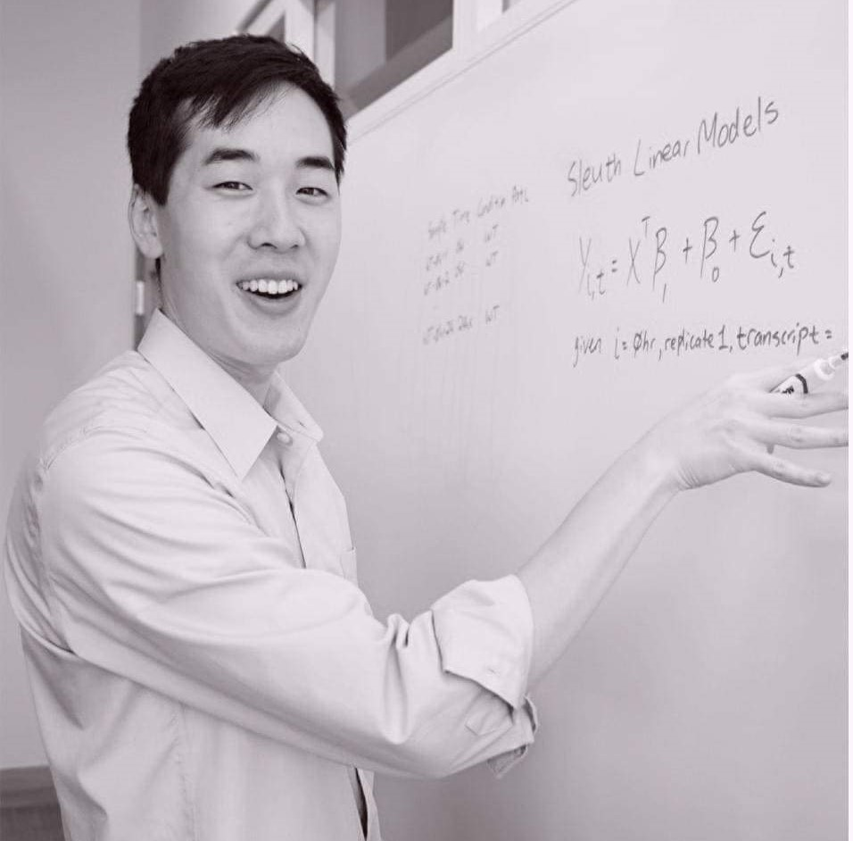

I graduated from the Biochemistry and Biophysics program at Oregon State University, then received my Master's degree in Bioinformatics at the University of Oregon. While in graduate school, I worked with Karen Guillemin's lab in Eugene, OR, and then interned under Dr. Chris Seidel in the Genomics department at the Stowers Institute. As a core bioinformatician, I collaborated with Dr. Nicolas Rohner's Lab to study the genetic adaptations of the cavefish Astayanx mexicanus. In the Maxson Lab, I provides bioinformatics support to all lab members and writes software to analyze sequencing datasets. I am always interested in the latest bioinformatics tools and trends, and I enjoy working with biologists at all levels of the computational spectrum.

Outside of the lab, I like to learn just about anything, go running, try out new restaurants, and enjoy my void slonk named Beans.

