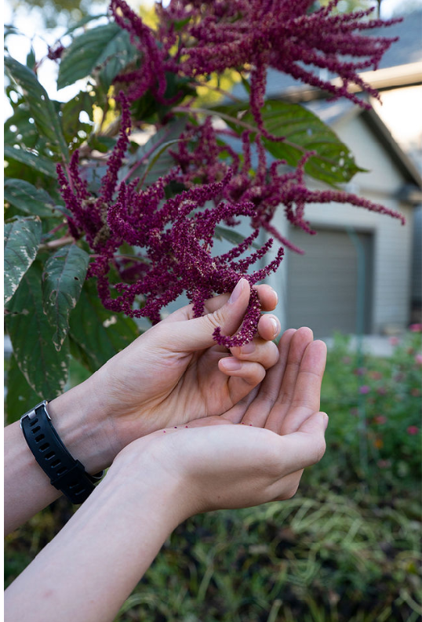
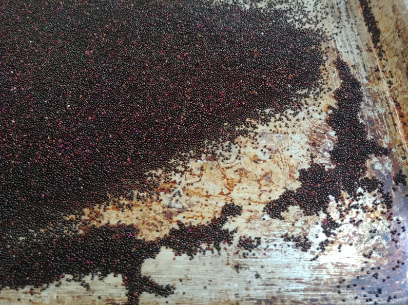
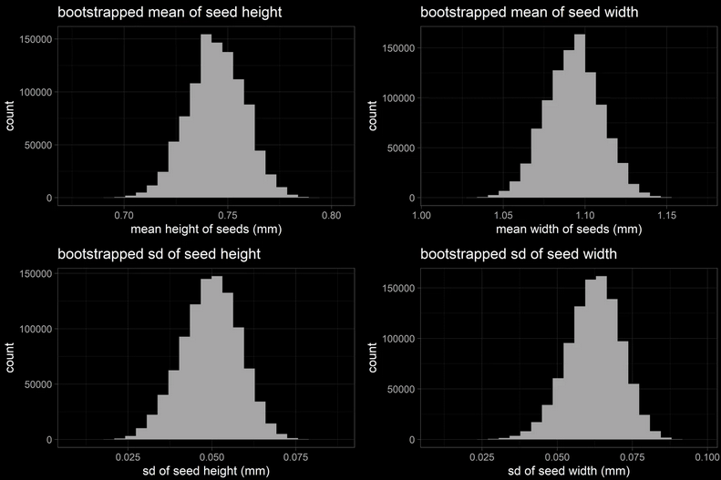
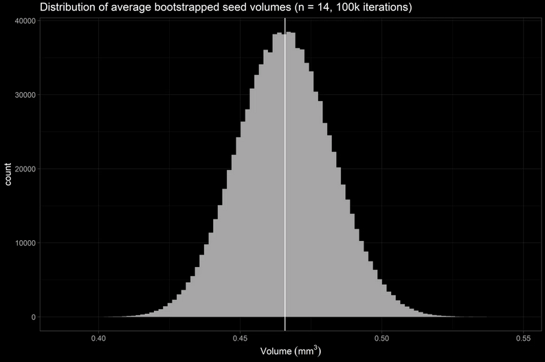

# Background

Amaranth (莧菜) is a South American crop originally planted by the Aztecs, and is consumed around the world today. Its leaves are fibrous and filling, the plant itself is a prolific grower in hot and humid climates, and amazingly each plant generates a staggering number of seeds about the size of the period at the end of this sentence. In fact, one plant can produce thousands of potent seeds; in other words, one plant can seed an acre of land. It is also one of my favorite plants because its leaves are great for soup, its seeds are nutritious and tastes like popcorn, and it’s a beautiful purple-pink, unwieldy, lavish mess of a plant to witness in person. In this project, I want to observe physical properties (width, height, volume, mass) of amaranth seeds, and amount of seeds produced per plant. I will be using tools of data science like R and basic statistics to supplement my observations.


_Flowering structure of the amaranth plant._


# Methods: seed harvesting

Harvesting amaranth seeds is not difficult, but it was time consuming (1.5 hrs) in order to maximize yield. About 100 grams of the flowering structure were harvested and placed into a bag. To separate the seeds from its flower, firmly pinch, rub, and pull on the flower structure – like the posture of the left hand in the above picture. This process takes the longest time because there are lots of branches and flowers.


_Drying seeds on a cookie sheet._

Once this is done, the seed / flower petal / branch mixture are sifted through a fine filter. The results won’t be biased for seeds that go through this filter because > 95% of the seeds can pass through this filter. Although this step is shorter, it is the step where seeds can get lost and scattered if impatient. The result is a mixture of seeds and flower petals. Since the flower petals are much lighter (and purplier) than the seeds, I purify the seeds by collecting them into a bowl, and gently blow on the seeds while one hand is making the swirling motion with the bowl. To improve the confetti-like experience, wearing sunglasses in this step will protect the eyes from scattering petals and enhance the confusion factor to strangers passing by. The seeds were laid on a flat surface for drying.

# Method: seed measurement

To estimate the approximately spheroid shape of amaranth seeds, the height and width must be experimentally determined. The height axis and width axes will be measured with digital calipers. Seeds were randomly selected out of a bag, measured, and then placed back, to yield 20 observations for height and width. To get a better estimation of the average size and standard deviation of amaranth seeds in this year’s crop, I will bootstrap the sample (sample_size = 14, 100K iterations), take the average and stdev per bootstrap sample, and calculate / visualize mean and sd of seed size parameters.

# Analysis 1 - Bootstrap Seed Dimensions

```R
library(here)
library(openxlsx)
library(ggplot2)
library(ggdark)
library(dplyr)
library(data.table)
library(RColorBrewer)
library(doParallel)
library(cowplot)
library(DT)
set.seed(42)

# Strategy: randomly sample height and width (sample_size = 14, 1e6 times) in parallel with doParallel
# Strategy: the resulting vectors will be used for mean, sd, and volume calculation. Calc and plot.

par.bootstrap <- function(sample, n, iterations) {
  # input: a vector to sample, sample size n, iterations amount of time. 
  # output: returns list of iterations amount of n-sized vectors, suitable for apply functions
  registerDoParallel(getDoParWorkers()) # use maximum amount of cores.
  b.vector <- foreach(i = 1:iterations) %dopar% {
    sample(x = sample, size = n, replace = TRUE)
  }
  return(b.vector)
}

B <- 1e6

# Mean
# apply mean or sd to list of vectors.
mean.height <- lapply(par.bootstrap(amrnth$Height, 0.7 * length(amrnth$Height), B), mean)
mean.width <- lapply(par.bootstrap(amrnth$Width, 0.7 * length(amrnth$Width), B), mean)

# sd 
sd.height <- lapply(par.bootstrap(amrnth$Height, 0.7 * length(amrnth$Height), B), sd)
sd.width <- lapply(par.bootstrap(amrnth$Width, 0.7 * length(amrnth$Width), B), sd)

# Visualize bootstrap statistics
p1 <- ggplot(melt(unlist(mean.height)), aes(x = value)) + geom_histogram(bins = 25) +
  ggtitle("bootstrapped mean of seed height") + 
  xlab("mean height of seeds (mm)") + 
  dark_theme_light()

p2 <- ggplot(melt(unlist(mean.width)), aes(x = value)) + geom_histogram(bins = 25) +
  ggtitle("bootstrapped mean of seed width") + 
  xlab("mean width of seeds (mm)") + 
  dark_theme_light()

p3 <- ggplot(melt(unlist(sd.height)), aes(x = value)) + geom_histogram(bins = 25) +
  ggtitle("bootstrapped sd of seed height") + 
  xlab("sd of seed height (mm)") + 
  dark_theme_light()

p4 <- ggplot(melt(unlist(sd.width)), aes(x = value)) + geom_histogram(bins = 25) +
  ggtitle("bootstrapped sd of seed width") + 
  xlab("sd of seed width (mm)") + 
  dark_theme_light()

bootstrap.mean.sd <- plot_grid(p1, p2, p3, p4, nrow = 2)

```



# Results: amaranth seed size

After random sampling of the original data 100K times with sample_size of 14 and taking each iteration’s mean and sd, we arrive to the following statistics and the following distributions:

    * bootstrapped mean seed height = 0.74 mm, normal distribution
    * bootstrapped mean seed width = 1.09 mm, normal distribution
    * bootstrapped sd of mean seed height = 0.05 mm, normal distribution
    * bootstrapped sd of mean seed width = 0.06 mm, normal distribution

 To calculate the volume of an amaranth seed, I use the formula of an oblate spheroid to yield a volume of 0.46 mm3. Since the volume per seed iteration was calculated, below is the volume distribution. Now that is tiny!

```R
amaranth <- as.data.frame(cbind(unlist(mean.height), unlist(mean.width)))
colnames(amaranth) <- c("height", "width")
amaranth <- amaranth %>% 
  mutate(volume = ( (pi/6) * (width**2 * height) ))

bootstrapped.mean <- ggplot(amaranth, aes(x = volume)) +
  geom_histogram(bins = 100) +
  ggtitle("Distribution of average bootstrapped seed volumes (n = 14, 100k iterations)") +
  xlab(bquote('Volume'~(mm^3))) +
  geom_vline(xintercept = mean(amaranth$volume)) +
  dark_theme_light()

```



# Results: yield calculations

Here are quick back-of-the-envelope calculations to see the yield of amaranth plants per season. Assuming I isolated 20 g of seed from 100 g of amaranth biomass (seeds + branches) from 12 plants, that is 1.67 grams of seeds per plant or 0.2 grams of seeds per gram of plant biomass.

For summer 2019, I harvested enough seeds to fill a snack sized ziploc bag (16.5 cm x 8.2 cm x about 2 cm depth) – that’s about 5.81×105 number of seeds. If I were to sow the seeds I harvested in one season 1 feet apart, this ficticious plantation would have 762 rows and columns (I don’t recommend pulling this off, but do it in Missouri if you must). To put that into perspective, that’s like clearing 3 oblong city blocks (260 m x 89 m) or 9 normal city blocks (81 m x 81 m) – and that’s just from 12 plants!

# Conclusions

The amaranth plant is a hardy and proliferative crop whose seeds are tiny and numerous. In this project, the physical aspects of the amaranth seed was quantitatively described; the height is 0.74 mm (sd = 0.05 mm), width of 1.09 mm (sd = 0.06 mm), and volume of 0.46 mm3. Addendum: amaranth math

The volume of a mol of amaranth seeds (2.7692×1023 mm3) is enough to:

* smother and fill the Stowers research institute 1.08 million times assuming 600K sq.ft workspace and 15 ft ceilings.
* cover the entire volume of the Great Lakes 12 times over
* pack the Pacific Ocean at 0.04% capacity