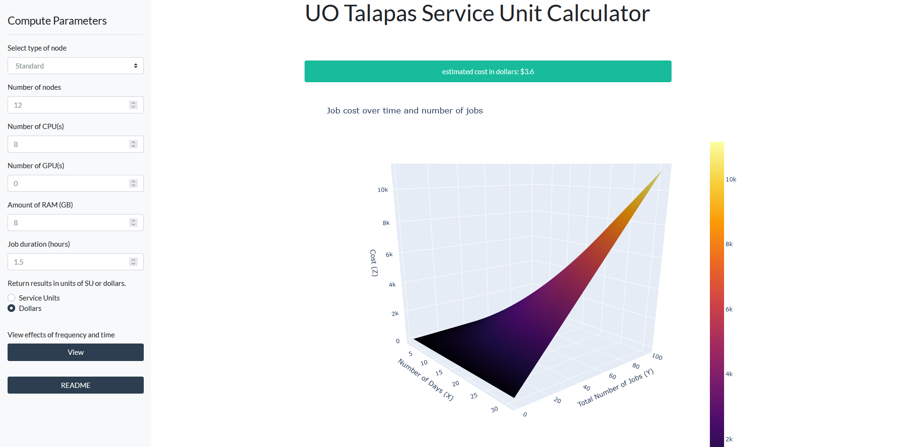

# Motivation

Couple of months ago while I was  unemployed, I was looking for opportunities to try something new to  improve my programming skills. Since my background is in bioinformatics, which deals with a lot of text-based data, I wanted to challenge myself in building visually appealing, interactive web applications. I decided to use Dash as my tool to improve my python skills. Here is the calculator: [https://su-calc.herokuapp.com/](https://su-calc.herokuapp.com/).

# Project

In my opinion, the best way to learn programming is to solve a real-life  problem (no matter how small). Then I realized that in my bioinformatics career so far, I never put much thought into the cost of jobs I submit  to the compute cluster. How much compute power can you buy with $50? Did I spend a fortune submitting poorly written bash scripts?

To estimate the financial costs, I based my answer found in this [webpage](https://hpcrcf.atlassian.net/wiki/spaces/TCP/pages/647299079/Service+Unit+Calculation) by the University of Oregon. In their compute cluster, named Talapas, the formula for a job is the following:

$$ Service\ Units = \sum_{1}^{allocNodes} (max(\dfrac{allocCPU}{totalCPU},  \dfrac{allocRAM}{totalRAM}, \dfrac{allocGPU}{totalGPU}) * NTF) * 28 SU / hr * job\_duration\ (hr)$$

The terms can be explained in the following:

| Term         | Resources requested                                          |
| ------------ | ------------------------------------------------------------ |
| allocNodes   | Number of nodes                                              |
| allocCPU     | Number of CPU cores                                          |
| totalCPU     | Total available CPU cores in a node                          |
| allocRAM     | Quantity of RAM (GB)                                         |
| totalRAM     | Total quantity of RAM (GB) in a node  In fat nodes, totalRAM is normalized to 1024 GB |
| allocGPU     | Number of GPU cores                                          |
| totalGPU     | Total quantity of GPU cores in a node                        |
| NTF          | Node type factor   1 = standard node  2 = gpu node   6 = fat node |
| 28 SU / hr   | Normalization factor.                                        |
| job_duration | Expected time required for the job (hr)                      |


# How is cost calculated?

The idea  here is that a job’s usage effectively amounts to the largest fraction  of resources utilized by the job on a node. For instance, if a job uses  all the available cores on a node but little memory then the job is  using 100% of the node (i.e. there are no cores available for other  jobs). Likewise, if a job is only using one core but requires 100% of  the memory on a node, that job is also using 100% of the node (there is  insufficient memory for other jobs).

Now we know that cost is  calculated by the resources you take up, let’s build a web application  to visualize everything. I highly recommend pulling up the app and the  source code side-by-side so you don’t get lost in all the code.

Here is the link for the calculator: [https://su-calc.herokuapp.com/](https://su-calc.herokuapp.com/)



# Build the app layout

The layout for this application was borrowed from this [link](https://dash-bootstrap-components.opensource.faculty.ai/examples/simple-sidebar/page-1), which contains a simple sidebar.

```python
import os
import sys
import re
import dash
import itertools
import dash_table
import pandas as pd
import plotly.graph_objs as go
import dash_core_components as dcc
import dash_html_components as html
import dash_bootstrap_components as dbc
from dash.dependencies import Input, Output
from dash_table.Format import Format, Scheme, Sign, Symbol

# Initiate the app ----------------------------------------------------------------
app = dash.Dash(__name__, external_stylesheets=[dbc.themes.FLATLY])
server = app.server
app.title="Talapas Calculator"

# app components ------------------------------------------------------------------

# the style arguments for the sidebar. We use position:fixed and a fixed width
SIDEBAR_STYLE = {
    "position": "fixed",
    "top": 0,
    "left": 0,
    "bottom": 0,
    "width": "20rem",
    "padding": "2rem 1rem",
    "background-color": "#f8f9fa",
}

# the styles for the main content position it to the right of the sidebar and add some padding.
CONTENT_STYLE = {
    "margin-left": "18rem",
    "margin-right": "2rem",
    "padding": "2rem 1rem",
}

```

I’m going to populate the sidebar with different dropdown menus to  accept information like requested nodes, RAM, CPU, GPU, and duration of  job. Then I will add space for the outputs (a cost, a graph, and a  table).

```python
# sidebar layout ------------------------------------------------------------------------
sidebar = html.Div(
    [
        html.H4("Compute Parameters"),
        html.Hr(),
        dbc.Nav([
            dbc.FormGroup([
                dbc.Label("Select type of node"),
                dbc.Select(
                    id="node_type",
                    options=[
                        {'label': 'Standard', 'value': 'std'},
                        {'label': 'GPU', 'value': 'gpu'},
                        {'label': 'High-Memory', 'value': 'fat'}
                        ])]),
            dbc.FormGroup([
                dbc.Label("Number of nodes"),
                dbc.Input(
                    id="node_count",
                    value=1,
                    type="number",
                    debounce=True,
                    min=0)]),
            dbc.FormGroup([
                dbc.Label("Number of CPU(s)"),
                dbc.Input(
                    id="input_cpu",
                    value=1,
                    type="number",
                    debounce=True,
                    min=0)]),
            dbc.FormGroup([
                dbc.Label("Number of GPU(s)"),
                dbc.Input(
                    id="input_gpu",
                    value=0,
                    type="number",
                    debounce=True,
                    min=0)]),
            dbc.FormGroup([
                dbc.Label("Amount of RAM (GB)"),
                dbc.Input(
                    id="input_ram",
                    value=4,
                    type="number",
                    debounce=True,
                    min=0)]),
            dbc.FormGroup([
                dbc.Label("Job duration (hours)"),
                dbc.Input(
                    id="job_duration",
                    value=2.5,
                    type="number",
                    debounce=True,
                    step=0.5)]),
            dbc.Label("Return results in units of SU or dollars."),
            dbc.RadioItems(
                id="input_units",
                value="units_dollars",
                options=[
                    {"label": "Service Units", "value": "units_su"},
                    {"label": "Dollars", "value": "units_dollars"}
                ]),
            html.Hr(),
            dbc.Label("View effects of frequency and time"),
            dbc.Button(
                "View",
                id="input_view",
                color = "primary"),
            html.Hr(),
            dbc.Button(
                "README",
                id="input_readme",
                color="primary"),
            readme_modal
            ],
            vertical=True, pills=True,
        ),
    ],
    style=SIDEBAR_STYLE,
)

content = html.Div(id="page-content", style=CONTENT_STYLE)

# app layout ----------------------------------------------------------------------
# using bootstrap to divide screen into 12 x 12 grid
app.layout = html.Div([
    # title
    dbc.Row(
        dbc.Col(
            html.H1("UO Talapas Service Unit Calculator", style={"white-space": "nowrap", "text-align": "center"}),
        width={"size": 4, "offset": 4}
    )),
    # sidebar
    sidebar, content,

    # estimated cost alert
    dbc.Row(
        dbc.Col(
            dbc.Alert(id = "output_su", children = [], color="success", style = {"text-align": "center"}, is_open = False),
        width={"size": 5, "offset": 4}
        ), align="center",
    ),

    # graph cost over time
    dbc.Row(
        dbc.Col(
            dcc.Loading(
                children = [
                dcc.Graph(id='output_graph', style={"width": "100%", "height": "100vh"})],
            ),
        width={"size": 6, "offset": 4}
    ), align="center",
    ),

    # table of cost over time
    dbc.Row(
        dbc.Col(
            dcc.Loading(children=[
                dash_table.DataTable(
                    id='output_table', 
                    style_table = {"width": "100%", "height": "75vh", "overflowY": "auto"}, 
                    style_as_list_view = True,
                    style_header = {'backgroundColor': 'white', 'fontWeight': 'bold'})
            ]),
            width={"size": 6, "offset": 4}
        ), align="center",
    ),

    # cached information - cost of job
    html.Div(id='intermediate_cost', style={'display': 'none'})
    ]
)

```

# Calculate job pricing

So far we  have only configured the visual app layout. Below is where we connect  the data input from users and push those variables through the formula.  When converting from SU to dollars, I used the conversion rate from this source. Before we get into it, I’ve defined some useful functions to  modularize the code:


```python
# vars and f(x) -------------------------------------------------------------------
su_dollar = 0.025 # number of dollars per service unit
# note: total gpu units in a node is hard-coded as 4 below. Introduce a tot_gpu option if hardware changes in the future.

# define top resource used - this is middle of the equation.
def top_resource(alloc_CPU, cpu_denominator, alloc_GPU, gpu_denominator, alloc_RAM, ram_denominator):
    return( max([alloc_CPU / cpu_denominator, alloc_GPU / gpu_denominator, alloc_RAM / ram_denominator]) )

# calculate cost of job over time and frequency
def cost_table(est_cost, max_days = 32, max_freq = 101, units = "units_su"):
    """ 
    Input: cost of job
    Output: a plot of job cost over time (x) and frequency (y)
    Method: take cost of job, and take cartesian product of days and frequency.
    """
    df_surface = pd.DataFrame(columns=['Number of Days', 'Total Number of Jobs'])
    for i in itertools.product(pd.Series(range(1, max_days)), pd.Series(range(1, max_freq))):
        temp_row = pd.Series(list(i), index=['Number of Days', 'Total Number of Jobs'])
        df_surface = df_surface.append(temp_row, ignore_index=True)
    if units == "units_su":
        df_surface = df_surface.assign(Cost = df_surface['Number of Days'] * df_surface['Total Number of Jobs'] * est_cost)
    elif units == "units_dollars":
        df_surface = df_surface.assign(Cost = df_surface['Number of Days'] * df_surface['Total Number of Jobs'] * est_cost * su_dollar)
    else:
        print("incorrect unit type. Must be 'units_su' or 'units_dollars'. ")
    return(df_surface)

def su_cost(node_type, node_count, cpu, gpu, ram, duration):
    """
    Calculates SU but only utilized for unit tests because different conda environments cannot use the app callback function as a standalone function.
    This is the exact same method used to get to SU calculations, but the output format is much more friendly for unit tests. This fx omits button clicks and dollar units.
    """
    if node_type == 'std':
        node_factor = 1
        tot_cpu = 28
        tot_ram = 128
    if node_type == 'gpu':
        node_factor = 2
        tot_cpu = 28
        tot_ram = 256
    if node_type == 'fat':
        node_factor = 6
        tot_cpu = 56
        tot_ram = 1024
    # job_setup = "current setup = {} node type + {} number of nodes + {} number of cpu # + {} number of ram + {} hrs duration of job + {} total cpu + {} total ram".format(node_type, node_count, cpu, ram, duration, tot_cpu, tot_ram)
    # calculate service units
    max_resource = top_resource(
        alloc_CPU = cpu, cpu_denominator = tot_cpu,
        alloc_GPU = gpu, gpu_denominator = 4,
        alloc_RAM = ram, ram_denominator = tot_ram)
    su = ( (node_count * (max_resource * node_factor)) * 28 * duration )
    return(su)

# Service Units Equation = SUM over allocated nodes(max(AllocCPU/TotCPU, AllocRAM/TotRAM, AllocGRES/TotGRES) * NTF) * 28 Service Units/hour * job duration in hours
```


We have defined the functions to be used, now we will see how they are utilized.

The heart of Dash is the callback, which defines how input and outputs are linked. Here is the code:

```python
import os
import sys
import re
import dash
import itertools
import dash_table
import pandas as pd
import plotly.graph_objs as go
import dash_core_components as dcc
import dash_html_components as html
import dash_bootstrap_components as dbc
from dash.dependencies import Input, Output
from dash_table.Format import Format, Scheme, Sign, Symbol

# Initiate the app ----------------------------------------------------------------
app = dash.Dash(__name__, external_stylesheets=[dbc.themes.FLATLY])
server = app.server
app.title="Talapas Calculator"

# app components ------------------------------------------------------------------

# the style arguments for the sidebar. We use position:fixed and a fixed width
SIDEBAR_STYLE = {
    "position": "fixed",
    "top": 0,
    "left": 0,
    "bottom": 0,
    "width": "20rem",
    "padding": "2rem 1rem",
    "background-color": "#f8f9fa",
}

# the styles for the main content position it to the right of the sidebar and add some padding.
CONTENT_STYLE = {
    "margin-left": "18rem",
    "margin-right": "2rem",
    "padding": "2rem 1rem",
}


I’m going to populate the sidebar with different dropdown menus to accept information like requested nodes, RAM, CPU, GPU, and duration of job. Then I will add space for the outputs (a cost, a graph, and a table).

# sidebar layout ------------------------------------------------------------------------
sidebar = html.Div(
    [
        html.H4("Compute Parameters"),
        html.Hr(),
        dbc.Nav([
            dbc.FormGroup([
                dbc.Label("Select type of node"),
                dbc.Select(
                    id="node_type",
                    options=[
                        {'label': 'Standard', 'value': 'std'},
                        {'label': 'GPU', 'value': 'gpu'},
                        {'label': 'High-Memory', 'value': 'fat'}
                        ])]),
            dbc.FormGroup([
                dbc.Label("Number of nodes"),
                dbc.Input(
                    id="node_count",
                    value=1,
                    type="number",
                    debounce=True,
                    min=0)]),
            dbc.FormGroup([
                dbc.Label("Number of CPU(s)"),
                dbc.Input(
                    id="input_cpu",
                    value=1,
                    type="number",
                    debounce=True,
                    min=0)]),
            dbc.FormGroup([
                dbc.Label("Number of GPU(s)"),
                dbc.Input(
                    id="input_gpu",
                    value=0,
                    type="number",
                    debounce=True,
                    min=0)]),
            dbc.FormGroup([
                dbc.Label("Amount of RAM (GB)"),
                dbc.Input(
                    id="input_ram",
                    value=4,
                    type="number",
                    debounce=True,
                    min=0)]),
            dbc.FormGroup([
                dbc.Label("Job duration (hours)"),
                dbc.Input(
                    id="job_duration",
                    value=2.5,
                    type="number",
                    debounce=True,
                    step=0.5)]),
            dbc.Label("Return results in units of SU or dollars."),
            dbc.RadioItems(
                id="input_units",
                value="units_dollars",
                options=[
                    {"label": "Service Units", "value": "units_su"},
                    {"label": "Dollars", "value": "units_dollars"}
                ]),
            html.Hr(),
            dbc.Label("View effects of frequency and time"),
            dbc.Button(
                "View",
                id="input_view",
                color = "primary"),
            html.Hr(),
            dbc.Button(
                "README",
                id="input_readme",
                color="primary"),
            readme_modal
            ],
            vertical=True, pills=True,
        ),
    ],
    style=SIDEBAR_STYLE,
)

content = html.Div(id="page-content", style=CONTENT_STYLE)

# app layout ----------------------------------------------------------------------
# using bootstrap to divide screen into 12 x 12 grid
app.layout = html.Div([
    # title
    dbc.Row(
        dbc.Col(
            html.H1("UO Talapas Service Unit Calculator", style={"white-space": "nowrap", "text-align": "center"}),
        width={"size": 4, "offset": 4}
    )),
    # sidebar
    sidebar, content,

    # estimated cost alert
    dbc.Row(
        dbc.Col(
            dbc.Alert(id = "output_su", children = [], color="success", style = {"text-align": "center"}, is_open = False),
        width={"size": 5, "offset": 4}
        ), align="center",
    ),

    # graph cost over time
    dbc.Row(
        dbc.Col(
            dcc.Loading(
                children = [
                dcc.Graph(id='output_graph', style={"width": "100%", "height": "100vh"})],
            ),
        width={"size": 6, "offset": 4}
    ), align="center",
    ),

    # table of cost over time
    dbc.Row(
        dbc.Col(
            dcc.Loading(children=[
                dash_table.DataTable(
                    id='output_table', 
                    style_table = {"width": "100%", "height": "75vh", "overflowY": "auto"}, 
                    style_as_list_view = True,
                    style_header = {'backgroundColor': 'white', 'fontWeight': 'bold'})
            ]),
            width={"size": 6, "offset": 4}
        ), align="center",
    ),

    # cached information - cost of job
    html.Div(id='intermediate_cost', style={'display': 'none'})
    ]
)

Calculate job pricing

So far we have only configured the visual app layout. Below is where we connect the data input from users and push those variables through the formula. When converting from SU to dollars, I used the conversion rate from this source. Before we get into it, I’ve defined some useful functions to modularize the code:

# vars and f(x) -------------------------------------------------------------------
su_dollar = 0.025 # number of dollars per service unit
# note: total gpu units in a node is hard-coded as 4 below. Introduce a tot_gpu option if hardware changes in the future.

# define top resource used - this is middle of the equation.
def top_resource(alloc_CPU, cpu_denominator, alloc_GPU, gpu_denominator, alloc_RAM, ram_denominator):
    return( max([alloc_CPU / cpu_denominator, alloc_GPU / gpu_denominator, alloc_RAM / ram_denominator]) )

# calculate cost of job over time and frequency
def cost_table(est_cost, max_days = 32, max_freq = 101, units = "units_su"):
    """ 
    Input: cost of job
    Output: a plot of job cost over time (x) and frequency (y)
    Method: take cost of job, and take cartesian product of days and frequency.
    """
    df_surface = pd.DataFrame(columns=['Number of Days', 'Total Number of Jobs'])
    for i in itertools.product(pd.Series(range(1, max_days)), pd.Series(range(1, max_freq))):
        temp_row = pd.Series(list(i), index=['Number of Days', 'Total Number of Jobs'])
        df_surface = df_surface.append(temp_row, ignore_index=True)
    if units == "units_su":
        df_surface = df_surface.assign(Cost = df_surface['Number of Days'] * df_surface['Total Number of Jobs'] * est_cost)
    elif units == "units_dollars":
        df_surface = df_surface.assign(Cost = df_surface['Number of Days'] * df_surface['Total Number of Jobs'] * est_cost * su_dollar)
    else:
        print("incorrect unit type. Must be 'units_su' or 'units_dollars'. ")
    return(df_surface)

def su_cost(node_type, node_count, cpu, gpu, ram, duration):
    """
    Calculates SU but only utilized for unit tests because different conda environments cannot use the app callback function as a standalone function.
    This is the exact same method used to get to SU calculations, but the output format is much more friendly for unit tests. This fx omits button clicks and dollar units.
    """
    if node_type == 'std':
        node_factor = 1
        tot_cpu = 28
        tot_ram = 128
    if node_type == 'gpu':
        node_factor = 2
        tot_cpu = 28
        tot_ram = 256
    if node_type == 'fat':
        node_factor = 6
        tot_cpu = 56
        tot_ram = 1024
    # job_setup = "current setup = {} node type + {} number of nodes + {} number of cpu # + {} number of ram + {} hrs duration of job + {} total cpu + {} total ram".format(node_type, node_count, cpu, ram, duration, tot_cpu, tot_ram)
    # calculate service units
    max_resource = top_resource(
        alloc_CPU = cpu, cpu_denominator = tot_cpu,
        alloc_GPU = gpu, gpu_denominator = 4,
        alloc_RAM = ram, ram_denominator = tot_ram)
    su = ( (node_count * (max_resource * node_factor)) * 28 * duration )
    return(su)

# Service Units Equation = SUM over allocated nodes(max(AllocCPU/TotCPU, AllocRAM/TotRAM, AllocGRES/TotGRES) * NTF) * 28 Service Units/hour * job duration in hours

We have defined the functions to be used, now we will see how they are utilized.

The heart of Dash is the callback, which defines how input and outputs are linked. Here is the code:

# app callbacks -------------------------------------------------------------------

# readme callback. Click to popup a readme page.
@app.callback(
    Output("output_readme", "is_open"),
    [Input("input_readme", "n_clicks")]
)
def readme(n_click):
    if n_click == None:
        return(False)
    if (n_click % 2 == 1):
        return(True)

# determine SU price requested.
# input are dropdowns available to the user. 
# output is cost of job to the UI and to the intermediate div so we can calc graph + table.
@app.callback(
    [Output("output_su", 'children'),
    Output("output_su", "is_open"),
    Output("intermediate_cost", "children")],
    [Input('node_type', 'value'),
    Input('node_count', 'value'),
    Input('input_cpu', 'value'),
    Input('input_gpu', 'value'),
    Input('input_ram', 'value'),
    Input('job_duration', 'value'),
    Input('input_units', 'value')], 
)
def calc_cost(node_type, node_count, cpu, gpu, ram, duration, units):
     # do not return anything if no user input
    if node_type == None:
        table_data = [] # empty table
        table_columns = []
        fig = go.Figure(data=[go.Mesh3d(x=[],y=[],z=[])])
        return(None, False, None)
        pass
    # adjust NTF, total RAM, total CPU by node type
    if node_type == 'std':
        node_factor = 1
        tot_cpu = 28
        tot_ram = 128
    if node_type == 'gpu':
        node_factor = 2
        tot_cpu = 28
        tot_ram = 256
    if node_type == 'fat':
        node_factor = 6
        tot_cpu = 56
        tot_ram = 1024
    # this is middle of equation.
    max_resource = top_resource(
        alloc_CPU = cpu, cpu_denominator = tot_cpu,
        alloc_GPU = gpu, gpu_denominator = 4,
        alloc_RAM = ram, ram_denominator = tot_ram)
    # multiply requested resource by time, type, and number of node.
    su = ( (node_count * (max_resource * node_factor)) * 28 * duration )
    # adjust output msg by units selected
    if units == "units_su":
        est_cost  = "estimated service units: {}".format(round(su, 2))
    if units == "units_dollars":
        est_cost = "estimated cost in dollars: ${}".format(round(su * su_dollar, 2))
    return(est_cost, True, su)


```

# Visualize job pricing over time and frequency

A lot times, we need to submit a job multiple times or over a very long  time. Visualizing the effects of time and frequency would be very useful for e.g. a PI looking to keep track of their expenses if they are to  hire multiple graduate students or technicians.

```python
# retrieve the intermediate price and create frequency and time table+graph
@app.callback(
    [Output("output_table", "data"),
    Output("output_table", "columns"),
    Output("output_graph", "figure")],
    [Input('intermediate_cost', 'children'),
    Input('input_units', 'value'),
    Input('input_view', 'n_clicks')]
)
def table_graph(price, units, n_click):
    # if the user doesn't click the button, do not show the table and graph.
    if n_click == None or n_click % 2 == 0:
        table_data = [] # empty table
        table_columns = []
        fig = go.Figure(data=[go.Mesh3d(x=[],y=[],z=[])])
        return(table_data, table_columns, fig)
    elif (n_click % 2 == 1):
        # build the table. data and styling goes here! Format() is a lifesaver.
        tbl = cost_table(price, units = units)
        table_data = tbl.to_dict('records')
        table_columns = [{"name": i, "id": i, "type": "numeric", "format": Format(precision=4)} for i in tbl.columns]
        # build the graph. data and styling goes here!
        fig = go.Figure(
            data=[go.Mesh3d(z=tbl['Cost'], 
            x=tbl['Number of Days'], 
            y = tbl['Total Number of Jobs'], 
            opacity=1, 
            intensity=tbl['Cost'], 
            colorscale="Inferno")])
        fig.update_layout(
            title="Job cost over time and number of jobs",
            scene = dict(
            xaxis_title="Number of Days (X)",
            yaxis_title="Total Number of Jobs (Y)",
            zaxis_title="Cost (Z)"))
    return(table_data, table_columns, fig)
# if you want an empty table, just return an empty list [] for output table's (data and columns) component id.
```

I basically pulled the `cost_table` function from before, which takes in a price, and multiplies it by  {1..31} days and {1..100} times. The result is a plane of numbers that  was plotted using a mesh plot via plotly.

# Unit tests

To be a good programmer, you  should assess whether your calculated answers matches sample  calculations. Luckily the source webpage had a couple calculations, so  all I had to do was match the input and output.

```python
# unit tests ----------------------------------------------------------------------

# Example 1 (CPU driven SU): User A submits a job that is allocated 14 cores and 32 GB of RAM on one standard compute node.  Each compute node has a total of 28 cores and 128GB of RAM.  The job runs for 10 hours.  The job would have consumed
assert su_cost('std', 1, 14, 0, 32, 10) == 140.0, "1 standard node using 14 cores and 28 GB RAM for 10 hrs does not equal 140 service units"

# Example 2 (Memory driven SU): User B submits a job that is allocated 7 cores and 128GB of RAM and one GPU on a GPU node. Each GPU node has a total of 28 cores and 256GB of RAM and 4 GPUs.  The job runs for 10 hours. Then the job would have consumed
assert su_cost('std', 1, 7, 1, 128, 10) == 280.0, "1 standard node using 7 cores and 128 GB RAM for 10 hrs does not equal 280 service units" # accommodate one gpu core

# Example 3 (GPU driven SU): User C submits a job to the GPU partition and that job is allocated 1 core, 16GB of RAM, and 3 GPUs. The nodes in the GPU partition have 28 cpus, 256 GB of RAM, and 4 GPUs. This job runs for 10 hours and will have consumed
assert su_cost('gpu', 1, 1, 3, 16, 10) == 420.0, "1 standard node using 7 cores and 128 GB RAM for 10 hrs does not equal 280 service units" # accommodate one gpu core

# Example 4 (CPU driven SU on Fat nodes): User D submits a job to the fat partition that is allocated 42 of the 56 available cpus and 512GB of memory.  The job finishes in 10 hours and will have consumed
assert su_cost('fat', 1, 42, 0, 512, 10) == 1260, "1 fat node using 42 cores and 512 GB RAM for 10 hrs does not equal 1260 service units"

# Example 5 (Memory driven SU on Fat nodes): User E submits a job to the fat partition that is allocated 4 of the 56 available cpus and 2TB (2048GB) of memory.  The job finishes in 10 hours and will have consumed
assert su_cost('fat', 1, 4, 0, 2048, 10) == 3360.0, "1 fat node using 4 cores and 2048 GB RAM for 10 hrs does not equal 3360 service units"

# Example 6 (Multiple standard nodes): User F submits a job that is allocated 16 standard nodes (28 cores and 128 GB of RAM per node, totaling 448 cores and 2048GB of memory).  The job runs for 10 hours and will have consumed
assert su_cost('std', 16, 28, 0, 128, 10) == 4480.0, "16 std nodes using 28 cores and 128 GB RAM for 10 hrs does not equal 4480 service units"
```

# Run the app

```python
# this last bit will run the app
if __name__ == '__main__':
    app.run_server(debug=True, use_reloader=False)
```

# Thoughts

This project was really unique  compared to my straight bioinformatic work. It had the right amount of  challenge for someone in my skill level. It took me about 3 intense days to finish this + 2 days to really polish the UI, and I am really happy  how it turned out.

The hardest part of the project was  understanding the callbacks, and how to modularize them. I initially had one large and messy callback, but then found a method to save variables onto the user browser session using the [hidden div method](https://dash.plotly.com/sharing-data-between-callbacks). Unfortunately this may not work so well if your web app uses a lot of  data, and I hope the devs finds a better way. Overall, I definitely look forward to opportunities to use Dash again.

# Disclaimer

This work is not endorsed by University of Oregon.