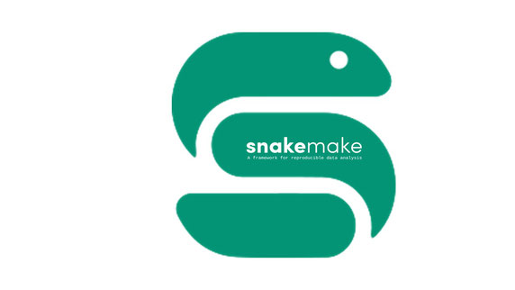

# Snake Make functions



SnakeMake is a pipeline-building tool made for bioinformatics in mind. It stems from [GNU Make](https://www.gnu.org/software/make/) where a "rule" provides a set of instructions (commands) to relate an input and output file. SnakeMake packs a multitude of easy-to-use-but-skillfully-implemented features such as parallel processing, discrete virtual environments per rule, and python functions as file inputs. It even wraps the current ecosystem of bioinformatic tools (e.g. bowtie2, macs2, disparate Bash/python/R scripts, docker containers) without introducing many friction points!

It is a great piece of software, but I often find myself typing long, monotonous, and verbose commands to invoke the pipeline; while I may be over-dramatic, the repeated stress of typing the same commands can build up to severe [repetitive strain injury](https://en.wikipedia.org/wiki/Repetitive_strain_injury) (RSI). The solution is to minimize your key strokes, and what better approach than to write custom bash functions!

Just paste and source each of the following functions into your `.bashrc` file to quickly define default AND variable parameters.

**<ins>S</ins>nakemake <ins>U</ins>nlock Current Directory**

```bash
su () {
	# 'snakemake unlock' a directory
	snakemake -j 1 --unlock
}
```

This is the most basic, now we start adding different arguments.

**<ins>S</ins>nakemake <ins>P</ins>rint Pipeline Commands**

```bash
sp () {
	# 'snakemake print' a dry run
	snakemake -j 1 -np $1
}
```

The extra $1 will accept new arguments; to use this, wrap multiple arguments within a pair of single or double-quotes such as `sp '-R deseq2'` which means to rerun DESeq2. The $1 allows us to quickly add new arguments to customize which parts of the pipeline to run. We could even do `sp '-R bowtie2 -U markd'` to re-align reads up to mark duplicate reads (inclusive) and not run the rest of the workflow.

**<ins>S</ins>nakemake <ins>R</ins>un A Rule**

```bash
sr () {
	# 'snakemake run' the pipeline locally
	snakemake -j 1 --use-conda $1
}
```

I am a heavy user of the conda integration, so I set the `--use-conda` flag there as a default parameter. I also use the `-j 1` flag so I only use one core. This command will run the pipeline locally, and is great for running a simple rule to generate plots in R for example. On the other hand, don't use this for heavier tasks like read alignment.

**<ins>S</ins>nakemake <ins>S</ins>ubmit Jobs to the Cluster**

```bash
ss () {
	# 'snakemake submit' pipeline jobs to SLURM
	snakemake -j $1 --use-conda --cluster-config cluster.yaml --profile slurm $2
}
```

`ss` will submit jobs to my institute's SLURM-based HPC. It now accepts the number of jobs and further SnakeMake flags as arguments, and is best used when running a pipeline at the beginning stages. For example, `ss 100` means to submit all the rules to the HPC and run 100 jobs at a time. If we notice we made a mistake (like aligning to the wrong genome), you can restart the entire pipeline with `ss 100 '--forceall'`.

So in summary the aliases are:

* `su` = unlock current working directory

* `sp` = print a dry run

* `sr` = run a rule

* `ss` = submit jobs to the cluster

SnakeMake has been a breakthrough in the bioinformatics field due to its useful features, ease of use, and contemporary bioinformatic tools; it should not be surprising to see it has [1400+ citations](https://academic.oup.com/bioinformatics/article/28/19/2520/290322) as of August 2021. In summary, I hope this was helpful for the fellow bioinformaticians who have or will develop RSI; I also hope this was insightful for non-bioinformaticians who can take some transferable concepts and apply it to their lives.