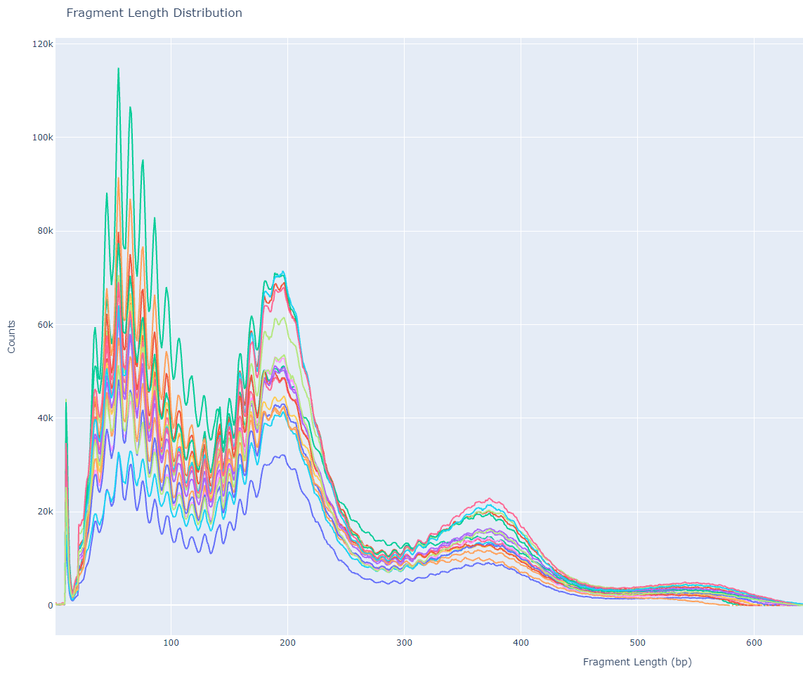
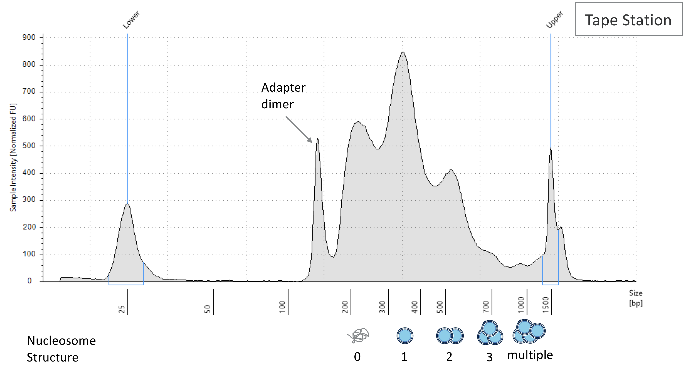

---



*Fragment length distribution of CUT&TAG data, aka lasagna plots*

---

# Background

[CUT&TAG](https://www.nature.com/articles/s41467-019-09982-5) is a new molecular biology technique developed by the Henikoff Lab at Fred Hutch Cancer Research Center in Seattle, WA. It detects the locations of histone mark modifications and transcription factor (TF) binding events in the genome by using an primary antibody that targets the molecule of interest. A secondary antibody, conjugated to a Tn5 transposase charged with sequencing adapters, recognizes the primary antibody and then cuts the DNA. At the time of DNA cleavage, sequencing adapters are ligated to the ends and then sequenced (with a little bit more QC work of course). This sequence-able snippet of DNA is the location of histone mark / TF binding.

When genomic DNA is fragmented and turned into a library, you can run your sample on a bioanalyzer machine to assess the size distribution of your DNA. Ideally there will be enrichment of signal correspond with to nucleosome-free fragments, reads that span one nucleosome (single blue circle), two nucleosomes (two blue circles), etc., as show in the figure below.


*DNA size distribution in ATAC-Seq; the trend is similar to CUT&TAG data. [Image source](https://kb.10xgenomics.com/hc/en-us/articles/360028207751-What-are-the-peaks-present-in-my-ATAC-library-trace-).*

**The distribution of fragment lengths is a sanity check to show what you will sequence, and this is a good indicator of library quality** If the shape is not well defined, then you may have low DNA yield or botched the experiment. While the bioanalyzer uses actual DNA material to assess DNA size, **we can use bioinformatic methods to find the same thing too!**

> The following tutorial also applies to other peak-based NGS data too like ATAC-Seq and ChIP-Seq. Interestingly, the ATAC-Seq and CUT&TAG distributions will look more similar to each other because they share the same Tn5 transposase enzyme.

# Tutorial: Fragment Length Distribution

To find your fragment length distribution, you must first align your reads to produce a BAM file then apply the following shell command to it. I initially wrote my command in a SnakeMake context, but feel free to just extract the shell part and put it in a loop.

```python

rule fraglength:
    input:
        "data/bowtie2/{sample}.bam"
    output:
        "data/fld/{sample}.fraglength.tsv"
    shell:
        "samtools view {input} | cut -f 9 | awk '$1 > 0' | sort | uniq -c | sort -b -k2,2n | awk -v OFS='\t' '{print $2,$1}'"
```

In the command above, we open the BAM file with samtools, select the 9th column which indicates the length of the fragment, filter for positive lengths, sort and then make a histogram of sizes, sort them by frequency (second column), and then reverse the columns so column-1 is frequency and column-2 is fragment size.You will end up with several files in `data/fld/{sample}.fraglength.tsv` where each file is a 2-column tsv with frequency and size just like the below snippet.

> 60      74024 <br>
> 61      82331 <br>
> 62      94538 <br>
> 63      107209 <br>
> 64      114850 <br>
> 65      107764 <br>
> 66      97747 <br>
> 67      86325 <br>
> 68      77139 <br>
> 69      76230 <br>
> 70      76163 <br>
> 71      83784 <br>
> 72      92463 <br>
> 73      101227 <br>
> 74      106595 <br>
> 75      105127 <br>
> 76      97563 <br>
> 77      87323 <br>
> 78      76844 <br>
> 79      72193 <br>
> 80      70243 <br>
> 81      74625 <br>
> 82      79839 <br>
> 83      87437 <br>
> 84      93651 <br>
> 85      95280 <br>

With a list of each sample's fragment length distributions, you can just use a small python script to generate a nice plotly graph. If you're not using SnakeMake, then your input is just a list of the tsv files.

```python
rule fraglength_plot:
    input:
        expand("data/fld/{sample}.fraglength.tsv", sample = samps)
    output:
        "data/fragment_length.html"
    run:
        pd.options.plotting.backend = "plotly"
        dfs = []
        for i in input:
            samp = [os.path.basename(i).split(".")[0]]
            temp_df = pd.read_csv(i, sep = "\t", index_col = 0, names = samp)
            dfs.append(temp_df)
        df = pd.concat(dfs, axis = 1)
        fraglen = df.plot()
        fraglen.update_layout( 
            title='Fragment Length Distribution', 
            xaxis_title='Fragment Length (bp)', 
            yaxis_title='Counts', 
            legend_title_text='Samples')
        fraglen.write_html(str(output))
```

The above script will import all the tsv files, set the first column as the index, and use sample's name the second column. The list of 1-column dataframes is concatenated column-wise (similar to cbind in R) and plotted, where the index is the X-axis and fragment length frequency per sample as the Y-axis. With a little bit of title and axes formatting, you can write the output to an HTML file and get the following image!


# Discussion

In this figure, we see a defined enrichment of signal at nucleosome-free (70 bp), mono-nucleosome (200 bp), and tri-nucleosome (380 bp) regions. The sharp periodicity of signal and large Y-axis values indicate that this is a high-quality library and is worthy of further downstream analysis. Sometimes there can be variation in periodicity (X-axis) across different data-sets, but the important thing to look out for is the decreasing signal at larger and larger fragment lengths.

What is unique to CUT&TAG data is the 10 bp periodicity most prominent between 70 bp and 200 bp. This could be due to the interaction between the Tn5 enzyme and favorable / unfavorable local structure of DNA at nucleosome-free regions. This pattern is less obvious as fragment length increases beyond mono-nucleosome regions. Since I am not so familiar with the behavior of the Tn5 enzyme, maybe a structural biologist could give some insight to this? I am all ears 🤷

**Okay Garth, where is the lasagna?** If you look closely at the graph, and it helps if you are hungry enough, you can see the synchronized waves of all the sample's signal build up to resemble a lasagna. In my interpretation of the figure, the red can either symbolize tomato sauce or importantly my need to get out of the lab and eat some carbs. Taking this analogy further, <ins>I would like to advocate renaming the fragment length distribution plot of CUT&TAG data to lasagna plots due to the shared toplogy</ins>. But all jokes aside, I hope there is something to be learned in this blog post whether you're a bench scientist, computationalist, or neither!