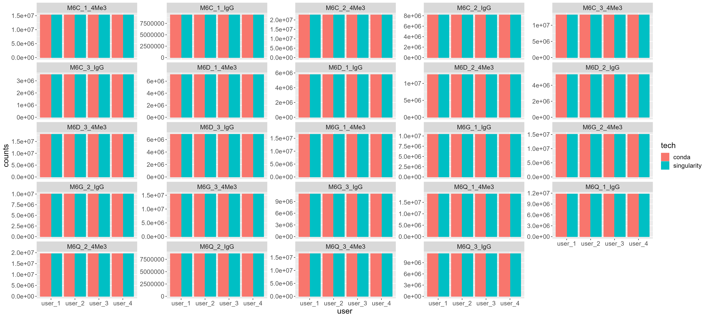
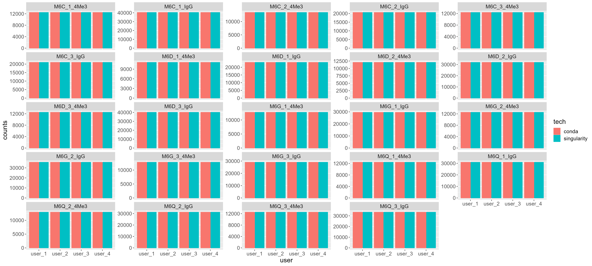
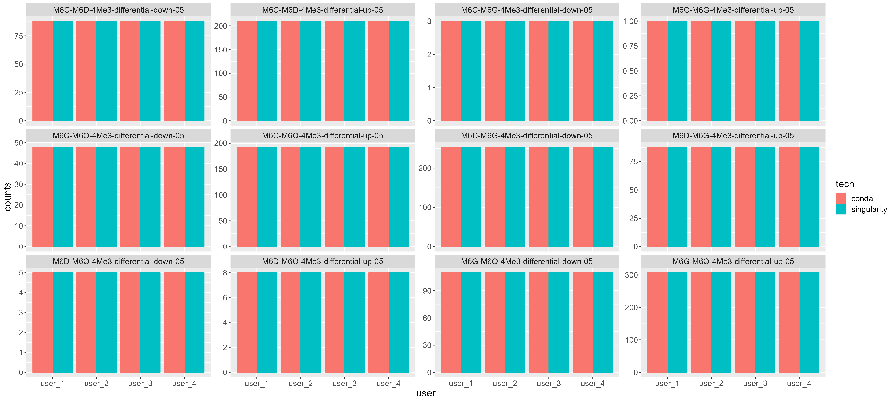

---

# Background

I have been tasked with building bioinformatic pipelines since I started my position at the Oregon Health and Science University at the Maxson and Braun Labs. Both labs study leukemia, the cancer of the blood, and patients often acquire mutations that disproportionately affect transcription factors or epigenetic regulators. As the labs utilize drug combinations to cure cancer and mitigate cancer resistance, one of the most common questions we ask are: how do the drug combinations work, and are the transcription factors / epigenetic regulators still binding to the genome under condition X (e.g. drug treatment)? 

A relatively new series of assay called CUT&Tag and CUT&RUN can determine the binding activity of proteins on DNA. After an experiment is performed (and assuming that antibodies are validated to recognize the target molecule), the libraries are sequenced and then analyzed. 

While developing the pipeline to analyze this type of data, I often wondered: **while my pipeline is reproducible in theory, is it actually reproducible in practice?**

In the following blog post, I used this [pipeline](https://github.com/maxsonBraunLab/cutTag-pipeline) which processes can CUT&Tag data using SnakeMake, Anaconda, Singularity, and various custom scripts in bash, python, and R.

# Experiment

For the testing dataset, I have used the following experimental scheme: 

| Condition | Replicate    | Mark           |
|-----------|--------------|----------------|
|     C     |     1        |     H3K4me3    |
|     C     |     2        |     H3K4me3    |
|     C     |     3        |     H3K4me3    |
|     G     |     1        |     H3K4me3    |
|     G     |     2        |     H3K4me3    |
|     G     |     3        |     H3K4me3    |
|     Q     |     1        |     H3K4me3    |
|     Q     |     2        |     H3K4me3    |
|     Q     |     3        |     H3K4me3    |
|     D     |     1        |     H3K4me3    |
|     D     |     2        |     H3K4me3    |
|     D     |     3        |     H3K4me3    |
|     C     |     1        |     IgG        |
|     C     |     2        |     IgG        |
|     C     |     3        |     IgG        |
|     G     |     1        |     IgG        |
|     G     |     2        |     IgG        |
|     G     |     3        |     IgG        |
|     Q     |     1        |     IgG        |
|     Q     |     2        |     IgG        |
|     Q     |     3        |     IgG        |
|     D     |     1        |     IgG        |
|     D     |     2        |     IgG        |
|     D     |     3        |     IgG        |

There are 4 conditions x 3 replicates x 2 marks = 24 covariates. 

Then for curiosity’s sake, I wanted to ask whether containerizing the pipeline via singularity will affect the output. Note that in all cases, anaconda will always be used.  So, the above matrix will be ‘multiplied’ with the following scheme:

|     User      |     Singularity    |     Anaconda    |
|---------------|--------------------|-----------------|
|     User_1    |     No             |     Yes         |
|     User_2    |     No             |     Yes         |
|     User_3    |     No             |     Yes         |
|     User_4    |     No             |     Yes         |
|     User_1    |     Yes            |     Yes         |
|     User_2    |     Yes            |     Yes         |
|     User_3    |     Yes            |     Yes         |
|     User_4    |     Yes            |     Yes         |

There are 4 users x 2 singularity options x 1 anaconda option = 8

The total covariates tested in the system is 8 x 24 = 192.

# Metrics for Success

Therefore, I decided to devise a simple experiment. If I handed this pipeline to multiple people in the lab, gave them the same dataset, and ran the pipeline in the same configuration, then the output should be exactly the same. The metrics I will use to keep track of progress are split between approximate and exact ones:

**Approximate**:

•	Number of lines in a BAM file

•	Number of peaks in the peak file

•	Number of differential peaks

The approximate metrics are easier to track and more of a ‘rule of thumb’ guide.  

**Exact**:

•	Md5sum of output peak files

•	Md5sum of output differential peak files

The exact metrics assess whether the output files are exactly the same between runs – zero deviations allowed. 

With 5 metrics to track, we'll end up with 5 x 192 = 960 data points.

**If the experiment works perfectly, then we expect the same metrics for all output files, and that the results do not change per person or container status.** 

Note that everything is run within the same institution.

# Results

## Number of lines in a BAM file

The plots are faceted by individual samples. Each x tick is a user, the y-axis shows the number of lines in the BAM file, and the color of the bar plot shows whether the user used singularity+conda or just conda alone. So far, the numbers completely matched up among every user regardless of technology or sample! 

## Number of peaks in the peak file

The number of peaks obtained per sample (treatment and IgG) is important to get right. This means that the peak caller (and previous steps like alignment and removal of duplicates) are generating the same data. 

## Number of differential peaks

The number of differential peaks is important to track whether a perturbation affected the binding ability of a transcription factor. That is why each facet is represented as a Condition1-vs-Condition2. These results are also split by up and downregulated factors for better granularity during downstream analyses. So far, the approximate metrics are giving very good results!

## Md5sum of output peak files

|md5sum                          |filename            |user  |tech       |
|--------------------------------|--------------------|------|-----------|
|09f0406c60b49de092a46afc7b66d6bb|M6G_2_4Me3_peaks.bed|user_1|conda      |
|09f0406c60b49de092a46afc7b66d6bb|M6G_2_4Me3_peaks.bed|user_1|singularity|
|09f0406c60b49de092a46afc7b66d6bb|M6G_2_4Me3_peaks.bed|user_2|conda      |
|09f0406c60b49de092a46afc7b66d6bb|M6G_2_4Me3_peaks.bed|user_2|singularity|
|09f0406c60b49de092a46afc7b66d6bb|M6G_2_4Me3_peaks.bed|user_3|conda      |
|09f0406c60b49de092a46afc7b66d6bb|M6G_2_4Me3_peaks.bed|user_3|singularity|
|09f0406c60b49de092a46afc7b66d6bb|M6G_2_4Me3_peaks.bed|user_4|conda      |
|09f0406c60b49de092a46afc7b66d6bb|M6G_2_4Me3_peaks.bed|user_4|singularity|
|128d5aad1463795a8ee6f9c91823216b|M6D_1_IgG_peaks.bed |user_1|conda      |
|128d5aad1463795a8ee6f9c91823216b|M6D_1_IgG_peaks.bed |user_1|singularity|
|128d5aad1463795a8ee6f9c91823216b|M6D_1_IgG_peaks.bed |user_2|conda      |
|128d5aad1463795a8ee6f9c91823216b|M6D_1_IgG_peaks.bed |user_2|singularity|
|128d5aad1463795a8ee6f9c91823216b|M6D_1_IgG_peaks.bed |user_3|conda      |
|128d5aad1463795a8ee6f9c91823216b|M6D_1_IgG_peaks.bed |user_3|singularity|
|128d5aad1463795a8ee6f9c91823216b|M6D_1_IgG_peaks.bed |user_4|conda      |
|128d5aad1463795a8ee6f9c91823216b|M6D_1_IgG_peaks.bed |user_4|singularity|
|131e6bc901d573c75a4a99ec4797d8d8|M6C_2_4Me3_peaks.bed|user_1|conda      |
|131e6bc901d573c75a4a99ec4797d8d8|M6C_2_4Me3_peaks.bed|user_1|singularity|
|131e6bc901d573c75a4a99ec4797d8d8|M6C_2_4Me3_peaks.bed|user_2|conda      |
|131e6bc901d573c75a4a99ec4797d8d8|M6C_2_4Me3_peaks.bed|user_2|singularity|
|131e6bc901d573c75a4a99ec4797d8d8|M6C_2_4Me3_peaks.bed|user_3|conda      |
|131e6bc901d573c75a4a99ec4797d8d8|M6C_2_4Me3_peaks.bed|user_3|singularity|
|131e6bc901d573c75a4a99ec4797d8d8|M6C_2_4Me3_peaks.bed|user_4|conda      |
|131e6bc901d573c75a4a99ec4797d8d8|M6C_2_4Me3_peaks.bed|user_4|singularity|
|27d4f4c79bbacc9c6f08b132c921bdd6|M6G_3_IgG_peaks.bed |user_1|conda      |
|27d4f4c79bbacc9c6f08b132c921bdd6|M6G_3_IgG_peaks.bed |user_1|singularity|
|27d4f4c79bbacc9c6f08b132c921bdd6|M6G_3_IgG_peaks.bed |user_2|conda      |
|27d4f4c79bbacc9c6f08b132c921bdd6|M6G_3_IgG_peaks.bed |user_2|singularity|
|27d4f4c79bbacc9c6f08b132c921bdd6|M6G_3_IgG_peaks.bed |user_3|conda      |
|27d4f4c79bbacc9c6f08b132c921bdd6|M6G_3_IgG_peaks.bed |user_3|singularity|
|27d4f4c79bbacc9c6f08b132c921bdd6|M6G_3_IgG_peaks.bed |user_4|conda      |
|27d4f4c79bbacc9c6f08b132c921bdd6|M6G_3_IgG_peaks.bed |user_4|singularity|
|303c6bf5aeaaadd05f667c9b4d6d61d7|M6D_2_4Me3_peaks.bed|user_1|conda      |
|303c6bf5aeaaadd05f667c9b4d6d61d7|M6D_2_4Me3_peaks.bed|user_1|singularity|
|303c6bf5aeaaadd05f667c9b4d6d61d7|M6D_2_4Me3_peaks.bed|user_2|conda      |
|303c6bf5aeaaadd05f667c9b4d6d61d7|M6D_2_4Me3_peaks.bed|user_2|singularity|
|303c6bf5aeaaadd05f667c9b4d6d61d7|M6D_2_4Me3_peaks.bed|user_3|conda      |
|303c6bf5aeaaadd05f667c9b4d6d61d7|M6D_2_4Me3_peaks.bed|user_3|singularity|
|303c6bf5aeaaadd05f667c9b4d6d61d7|M6D_2_4Me3_peaks.bed|user_4|conda      |
|303c6bf5aeaaadd05f667c9b4d6d61d7|M6D_2_4Me3_peaks.bed|user_4|singularity|
|401f85015b58e8e6a897b8cde403e02a|M6C_1_4Me3_peaks.bed|user_1|conda      |
|401f85015b58e8e6a897b8cde403e02a|M6C_1_4Me3_peaks.bed|user_1|singularity|
|401f85015b58e8e6a897b8cde403e02a|M6C_1_4Me3_peaks.bed|user_2|conda      |
|401f85015b58e8e6a897b8cde403e02a|M6C_1_4Me3_peaks.bed|user_2|singularity|
|401f85015b58e8e6a897b8cde403e02a|M6C_1_4Me3_peaks.bed|user_3|conda      |
|401f85015b58e8e6a897b8cde403e02a|M6C_1_4Me3_peaks.bed|user_3|singularity|
|401f85015b58e8e6a897b8cde403e02a|M6C_1_4Me3_peaks.bed|user_4|conda      |
|401f85015b58e8e6a897b8cde403e02a|M6C_1_4Me3_peaks.bed|user_4|singularity|
|4fa907229f2b8384e939dd5326444eb0|M6D_3_IgG_peaks.bed |user_1|conda      |
|4fa907229f2b8384e939dd5326444eb0|M6D_3_IgG_peaks.bed |user_1|singularity|
|4fa907229f2b8384e939dd5326444eb0|M6D_3_IgG_peaks.bed |user_2|conda      |
|4fa907229f2b8384e939dd5326444eb0|M6D_3_IgG_peaks.bed |user_2|singularity|
|4fa907229f2b8384e939dd5326444eb0|M6D_3_IgG_peaks.bed |user_3|conda      |
|4fa907229f2b8384e939dd5326444eb0|M6D_3_IgG_peaks.bed |user_3|singularity|
|4fa907229f2b8384e939dd5326444eb0|M6D_3_IgG_peaks.bed |user_4|conda      |
|4fa907229f2b8384e939dd5326444eb0|M6D_3_IgG_peaks.bed |user_4|singularity|
|615f91df536840ed3f922d40c2d4b6c8|M6C_3_4Me3_peaks.bed|user_1|conda      |
|615f91df536840ed3f922d40c2d4b6c8|M6C_3_4Me3_peaks.bed|user_1|singularity|
|615f91df536840ed3f922d40c2d4b6c8|M6C_3_4Me3_peaks.bed|user_2|conda      |
|615f91df536840ed3f922d40c2d4b6c8|M6C_3_4Me3_peaks.bed|user_2|singularity|
|615f91df536840ed3f922d40c2d4b6c8|M6C_3_4Me3_peaks.bed|user_3|conda      |
|615f91df536840ed3f922d40c2d4b6c8|M6C_3_4Me3_peaks.bed|user_3|singularity|
|615f91df536840ed3f922d40c2d4b6c8|M6C_3_4Me3_peaks.bed|user_4|conda      |
|615f91df536840ed3f922d40c2d4b6c8|M6C_3_4Me3_peaks.bed|user_4|singularity|
|69f118a18c90e712ec23e199816fd3c1|M6Q_2_IgG_peaks.bed |user_1|conda      |
|69f118a18c90e712ec23e199816fd3c1|M6Q_2_IgG_peaks.bed |user_1|singularity|
|69f118a18c90e712ec23e199816fd3c1|M6Q_2_IgG_peaks.bed |user_2|conda      |
|69f118a18c90e712ec23e199816fd3c1|M6Q_2_IgG_peaks.bed |user_2|singularity|
|69f118a18c90e712ec23e199816fd3c1|M6Q_2_IgG_peaks.bed |user_3|conda      |
|69f118a18c90e712ec23e199816fd3c1|M6Q_2_IgG_peaks.bed |user_3|singularity|
|69f118a18c90e712ec23e199816fd3c1|M6Q_2_IgG_peaks.bed |user_4|conda      |
|69f118a18c90e712ec23e199816fd3c1|M6Q_2_IgG_peaks.bed |user_4|singularity|
|6b4e3ae38b74407ac1f3bf0dd4553107|M6D_1_4Me3_peaks.bed|user_1|conda      |
|6b4e3ae38b74407ac1f3bf0dd4553107|M6D_1_4Me3_peaks.bed|user_1|singularity|
|6b4e3ae38b74407ac1f3bf0dd4553107|M6D_1_4Me3_peaks.bed|user_2|conda      |
|6b4e3ae38b74407ac1f3bf0dd4553107|M6D_1_4Me3_peaks.bed|user_2|singularity|
|6b4e3ae38b74407ac1f3bf0dd4553107|M6D_1_4Me3_peaks.bed|user_3|conda      |
|6b4e3ae38b74407ac1f3bf0dd4553107|M6D_1_4Me3_peaks.bed|user_3|singularity|
|6b4e3ae38b74407ac1f3bf0dd4553107|M6D_1_4Me3_peaks.bed|user_4|conda      |
|6b4e3ae38b74407ac1f3bf0dd4553107|M6D_1_4Me3_peaks.bed|user_4|singularity|
|7f8bfa5a75bffdd418b637bbb5681ae9|M6G_3_4Me3_peaks.bed|user_1|conda      |
|7f8bfa5a75bffdd418b637bbb5681ae9|M6G_3_4Me3_peaks.bed|user_1|singularity|
|7f8bfa5a75bffdd418b637bbb5681ae9|M6G_3_4Me3_peaks.bed|user_2|conda      |
|7f8bfa5a75bffdd418b637bbb5681ae9|M6G_3_4Me3_peaks.bed|user_2|singularity|
|7f8bfa5a75bffdd418b637bbb5681ae9|M6G_3_4Me3_peaks.bed|user_3|conda      |
|7f8bfa5a75bffdd418b637bbb5681ae9|M6G_3_4Me3_peaks.bed|user_3|singularity|
|7f8bfa5a75bffdd418b637bbb5681ae9|M6G_3_4Me3_peaks.bed|user_4|conda      |
|7f8bfa5a75bffdd418b637bbb5681ae9|M6G_3_4Me3_peaks.bed|user_4|singularity|
|8b166a283ab47d75258ca335cf38a3f0|M6C_3_IgG_peaks.bed |user_1|conda      |
|8b166a283ab47d75258ca335cf38a3f0|M6C_3_IgG_peaks.bed |user_1|singularity|
|8b166a283ab47d75258ca335cf38a3f0|M6C_3_IgG_peaks.bed |user_2|conda      |
|8b166a283ab47d75258ca335cf38a3f0|M6C_3_IgG_peaks.bed |user_2|singularity|
|8b166a283ab47d75258ca335cf38a3f0|M6C_3_IgG_peaks.bed |user_3|conda      |
|8b166a283ab47d75258ca335cf38a3f0|M6C_3_IgG_peaks.bed |user_3|singularity|
|8b166a283ab47d75258ca335cf38a3f0|M6C_3_IgG_peaks.bed |user_4|conda      |
|8b166a283ab47d75258ca335cf38a3f0|M6C_3_IgG_peaks.bed |user_4|singularity|
|9a488f41694d5671a89ad8b1da3a791e|M6C_1_IgG_peaks.bed |user_1|conda      |
|9a488f41694d5671a89ad8b1da3a791e|M6C_1_IgG_peaks.bed |user_1|singularity|
|9a488f41694d5671a89ad8b1da3a791e|M6C_1_IgG_peaks.bed |user_2|conda      |
|9a488f41694d5671a89ad8b1da3a791e|M6C_1_IgG_peaks.bed |user_2|singularity|
|9a488f41694d5671a89ad8b1da3a791e|M6C_1_IgG_peaks.bed |user_3|conda      |
|9a488f41694d5671a89ad8b1da3a791e|M6C_1_IgG_peaks.bed |user_3|singularity|
|9a488f41694d5671a89ad8b1da3a791e|M6C_1_IgG_peaks.bed |user_4|conda      |
|9a488f41694d5671a89ad8b1da3a791e|M6C_1_IgG_peaks.bed |user_4|singularity|
|a2c1db0f81d91aa01de91b452a6a1680|M6D_2_IgG_peaks.bed |user_1|conda      |
|a2c1db0f81d91aa01de91b452a6a1680|M6D_2_IgG_peaks.bed |user_1|singularity|
|a2c1db0f81d91aa01de91b452a6a1680|M6D_2_IgG_peaks.bed |user_2|conda      |
|a2c1db0f81d91aa01de91b452a6a1680|M6D_2_IgG_peaks.bed |user_2|singularity|
|a2c1db0f81d91aa01de91b452a6a1680|M6D_2_IgG_peaks.bed |user_3|conda      |
|a2c1db0f81d91aa01de91b452a6a1680|M6D_2_IgG_peaks.bed |user_3|singularity|
|a2c1db0f81d91aa01de91b452a6a1680|M6D_2_IgG_peaks.bed |user_4|conda      |
|a2c1db0f81d91aa01de91b452a6a1680|M6D_2_IgG_peaks.bed |user_4|singularity|
|a470776dd4a3d3319a07d4089f7e96c9|M6Q_1_4Me3_peaks.bed|user_1|conda      |
|a470776dd4a3d3319a07d4089f7e96c9|M6Q_1_4Me3_peaks.bed|user_1|singularity|
|a470776dd4a3d3319a07d4089f7e96c9|M6Q_1_4Me3_peaks.bed|user_2|conda      |
|a470776dd4a3d3319a07d4089f7e96c9|M6Q_1_4Me3_peaks.bed|user_2|singularity|
|a470776dd4a3d3319a07d4089f7e96c9|M6Q_1_4Me3_peaks.bed|user_3|conda      |
|a470776dd4a3d3319a07d4089f7e96c9|M6Q_1_4Me3_peaks.bed|user_3|singularity|
|a470776dd4a3d3319a07d4089f7e96c9|M6Q_1_4Me3_peaks.bed|user_4|conda      |
|a470776dd4a3d3319a07d4089f7e96c9|M6Q_1_4Me3_peaks.bed|user_4|singularity|
|c45bc8d3c352f120f37bebdc4af11dc9|M6Q_3_4Me3_peaks.bed|user_1|conda      |
|c45bc8d3c352f120f37bebdc4af11dc9|M6Q_3_4Me3_peaks.bed|user_1|singularity|
|c45bc8d3c352f120f37bebdc4af11dc9|M6Q_3_4Me3_peaks.bed|user_2|conda      |
|c45bc8d3c352f120f37bebdc4af11dc9|M6Q_3_4Me3_peaks.bed|user_2|singularity|
|c45bc8d3c352f120f37bebdc4af11dc9|M6Q_3_4Me3_peaks.bed|user_3|conda      |
|c45bc8d3c352f120f37bebdc4af11dc9|M6Q_3_4Me3_peaks.bed|user_3|singularity|
|c45bc8d3c352f120f37bebdc4af11dc9|M6Q_3_4Me3_peaks.bed|user_4|conda      |
|c45bc8d3c352f120f37bebdc4af11dc9|M6Q_3_4Me3_peaks.bed|user_4|singularity|
|cbb5e22080bfd8aa685363e2ade7488c|M6D_3_4Me3_peaks.bed|user_1|conda      |
|cbb5e22080bfd8aa685363e2ade7488c|M6D_3_4Me3_peaks.bed|user_1|singularity|
|cbb5e22080bfd8aa685363e2ade7488c|M6D_3_4Me3_peaks.bed|user_2|conda      |
|cbb5e22080bfd8aa685363e2ade7488c|M6D_3_4Me3_peaks.bed|user_2|singularity|
|cbb5e22080bfd8aa685363e2ade7488c|M6D_3_4Me3_peaks.bed|user_3|conda      |
|cbb5e22080bfd8aa685363e2ade7488c|M6D_3_4Me3_peaks.bed|user_3|singularity|
|cbb5e22080bfd8aa685363e2ade7488c|M6D_3_4Me3_peaks.bed|user_4|conda      |
|cbb5e22080bfd8aa685363e2ade7488c|M6D_3_4Me3_peaks.bed|user_4|singularity|
|d2da5436557c67066a6880e279bc5602|M6C_2_IgG_peaks.bed |user_1|conda      |
|d2da5436557c67066a6880e279bc5602|M6C_2_IgG_peaks.bed |user_1|singularity|
|d2da5436557c67066a6880e279bc5602|M6C_2_IgG_peaks.bed |user_2|conda      |
|d2da5436557c67066a6880e279bc5602|M6C_2_IgG_peaks.bed |user_2|singularity|
|d2da5436557c67066a6880e279bc5602|M6C_2_IgG_peaks.bed |user_3|conda      |
|d2da5436557c67066a6880e279bc5602|M6C_2_IgG_peaks.bed |user_3|singularity|
|d2da5436557c67066a6880e279bc5602|M6C_2_IgG_peaks.bed |user_4|conda      |
|d2da5436557c67066a6880e279bc5602|M6C_2_IgG_peaks.bed |user_4|singularity|
|d75d07d213cecc26b3ba267ffad23c5e|M6Q_3_IgG_peaks.bed |user_1|conda      |
|d75d07d213cecc26b3ba267ffad23c5e|M6Q_3_IgG_peaks.bed |user_1|singularity|
|d75d07d213cecc26b3ba267ffad23c5e|M6Q_3_IgG_peaks.bed |user_2|conda      |
|d75d07d213cecc26b3ba267ffad23c5e|M6Q_3_IgG_peaks.bed |user_2|singularity|
|d75d07d213cecc26b3ba267ffad23c5e|M6Q_3_IgG_peaks.bed |user_3|conda      |
|d75d07d213cecc26b3ba267ffad23c5e|M6Q_3_IgG_peaks.bed |user_3|singularity|
|d75d07d213cecc26b3ba267ffad23c5e|M6Q_3_IgG_peaks.bed |user_4|conda      |
|d75d07d213cecc26b3ba267ffad23c5e|M6Q_3_IgG_peaks.bed |user_4|singularity|
|e1c5fcd60e4b9ae0f4dee66ee98911e8|M6G_2_IgG_peaks.bed |user_1|conda      |
|e1c5fcd60e4b9ae0f4dee66ee98911e8|M6G_2_IgG_peaks.bed |user_1|singularity|
|e1c5fcd60e4b9ae0f4dee66ee98911e8|M6G_2_IgG_peaks.bed |user_2|conda      |
|e1c5fcd60e4b9ae0f4dee66ee98911e8|M6G_2_IgG_peaks.bed |user_2|singularity|
|e1c5fcd60e4b9ae0f4dee66ee98911e8|M6G_2_IgG_peaks.bed |user_3|conda      |
|e1c5fcd60e4b9ae0f4dee66ee98911e8|M6G_2_IgG_peaks.bed |user_3|singularity|
|e1c5fcd60e4b9ae0f4dee66ee98911e8|M6G_2_IgG_peaks.bed |user_4|conda      |
|e1c5fcd60e4b9ae0f4dee66ee98911e8|M6G_2_IgG_peaks.bed |user_4|singularity|
|e21e71be7c7f2968c1df7ef1b13e2107|M6G_1_IgG_peaks.bed |user_1|conda      |
|e21e71be7c7f2968c1df7ef1b13e2107|M6G_1_IgG_peaks.bed |user_1|singularity|
|e21e71be7c7f2968c1df7ef1b13e2107|M6G_1_IgG_peaks.bed |user_2|conda      |
|e21e71be7c7f2968c1df7ef1b13e2107|M6G_1_IgG_peaks.bed |user_2|singularity|
|e21e71be7c7f2968c1df7ef1b13e2107|M6G_1_IgG_peaks.bed |user_3|conda      |
|e21e71be7c7f2968c1df7ef1b13e2107|M6G_1_IgG_peaks.bed |user_3|singularity|
|e21e71be7c7f2968c1df7ef1b13e2107|M6G_1_IgG_peaks.bed |user_4|conda      |
|e21e71be7c7f2968c1df7ef1b13e2107|M6G_1_IgG_peaks.bed |user_4|singularity|
|e477d8b7cb645fba0e0157f49d4f2567|M6G_1_4Me3_peaks.bed|user_1|conda      |
|e477d8b7cb645fba0e0157f49d4f2567|M6G_1_4Me3_peaks.bed|user_1|singularity|
|e477d8b7cb645fba0e0157f49d4f2567|M6G_1_4Me3_peaks.bed|user_2|conda      |
|e477d8b7cb645fba0e0157f49d4f2567|M6G_1_4Me3_peaks.bed|user_2|singularity|
|e477d8b7cb645fba0e0157f49d4f2567|M6G_1_4Me3_peaks.bed|user_3|conda      |
|e477d8b7cb645fba0e0157f49d4f2567|M6G_1_4Me3_peaks.bed|user_3|singularity|
|e477d8b7cb645fba0e0157f49d4f2567|M6G_1_4Me3_peaks.bed|user_4|conda      |
|e477d8b7cb645fba0e0157f49d4f2567|M6G_1_4Me3_peaks.bed|user_4|singularity|
|f3fe93fac9099c4add7e26298fe8ec58|M6Q_1_IgG_peaks.bed |user_1|conda      |
|f3fe93fac9099c4add7e26298fe8ec58|M6Q_1_IgG_peaks.bed |user_1|singularity|
|f3fe93fac9099c4add7e26298fe8ec58|M6Q_1_IgG_peaks.bed |user_2|conda      |
|f3fe93fac9099c4add7e26298fe8ec58|M6Q_1_IgG_peaks.bed |user_2|singularity|
|f3fe93fac9099c4add7e26298fe8ec58|M6Q_1_IgG_peaks.bed |user_3|conda      |
|f3fe93fac9099c4add7e26298fe8ec58|M6Q_1_IgG_peaks.bed |user_3|singularity|
|f3fe93fac9099c4add7e26298fe8ec58|M6Q_1_IgG_peaks.bed |user_4|conda      |
|f3fe93fac9099c4add7e26298fe8ec58|M6Q_1_IgG_peaks.bed |user_4|singularity|
|f50db28ff72aac2229508fa9224f1ef8|M6Q_2_4Me3_peaks.bed|user_1|conda      |
|f50db28ff72aac2229508fa9224f1ef8|M6Q_2_4Me3_peaks.bed|user_1|singularity|
|f50db28ff72aac2229508fa9224f1ef8|M6Q_2_4Me3_peaks.bed|user_2|conda      |
|f50db28ff72aac2229508fa9224f1ef8|M6Q_2_4Me3_peaks.bed|user_2|singularity|
|f50db28ff72aac2229508fa9224f1ef8|M6Q_2_4Me3_peaks.bed|user_3|conda      |
|f50db28ff72aac2229508fa9224f1ef8|M6Q_2_4Me3_peaks.bed|user_3|singularity|
|f50db28ff72aac2229508fa9224f1ef8|M6Q_2_4Me3_peaks.bed|user_4|conda      |
|f50db28ff72aac2229508fa9224f1ef8|M6Q_2_4Me3_peaks.bed|user_4|singularity|

## Md5sum of output differential peak files

|md5sum                          |filename            |user  |tech       |
|--------------------------------|--------------------|------|-----------|
|0c3c42a3f3ce51fd6753b7a5aac2bc1a|M6D-M6G-4Me3-differential-down-05.bed|user_1|conda      |
|0c3c42a3f3ce51fd6753b7a5aac2bc1a|M6D-M6G-4Me3-differential-down-05.bed|user_1|singularity|
|0c3c42a3f3ce51fd6753b7a5aac2bc1a|M6D-M6G-4Me3-differential-down-05.bed|user_2|conda      |
|0c3c42a3f3ce51fd6753b7a5aac2bc1a|M6D-M6G-4Me3-differential-down-05.bed|user_2|singularity|
|0c3c42a3f3ce51fd6753b7a5aac2bc1a|M6D-M6G-4Me3-differential-down-05.bed|user_3|conda      |
|0c3c42a3f3ce51fd6753b7a5aac2bc1a|M6D-M6G-4Me3-differential-down-05.bed|user_3|singularity|
|0c3c42a3f3ce51fd6753b7a5aac2bc1a|M6D-M6G-4Me3-differential-down-05.bed|user_4|conda      |
|0c3c42a3f3ce51fd6753b7a5aac2bc1a|M6D-M6G-4Me3-differential-down-05.bed|user_4|singularity|
|213898c1c6030ce25d9a5be8e1173894|M6C-M6Q-4Me3-differential-down-05.bed|user_1|conda      |
|213898c1c6030ce25d9a5be8e1173894|M6C-M6Q-4Me3-differential-down-05.bed|user_1|singularity|
|213898c1c6030ce25d9a5be8e1173894|M6C-M6Q-4Me3-differential-down-05.bed|user_2|conda      |
|213898c1c6030ce25d9a5be8e1173894|M6C-M6Q-4Me3-differential-down-05.bed|user_2|singularity|
|213898c1c6030ce25d9a5be8e1173894|M6C-M6Q-4Me3-differential-down-05.bed|user_3|conda      |
|213898c1c6030ce25d9a5be8e1173894|M6C-M6Q-4Me3-differential-down-05.bed|user_3|singularity|
|213898c1c6030ce25d9a5be8e1173894|M6C-M6Q-4Me3-differential-down-05.bed|user_4|conda      |
|213898c1c6030ce25d9a5be8e1173894|M6C-M6Q-4Me3-differential-down-05.bed|user_4|singularity|
|28aee01ebdcca2eaf695618fca393722|M6C-M6D-4Me3-differential-down-05.bed|user_1|conda      |
|28aee01ebdcca2eaf695618fca393722|M6C-M6D-4Me3-differential-down-05.bed|user_1|singularity|
|28aee01ebdcca2eaf695618fca393722|M6C-M6D-4Me3-differential-down-05.bed|user_2|conda      |
|28aee01ebdcca2eaf695618fca393722|M6C-M6D-4Me3-differential-down-05.bed|user_2|singularity|
|28aee01ebdcca2eaf695618fca393722|M6C-M6D-4Me3-differential-down-05.bed|user_3|conda      |
|28aee01ebdcca2eaf695618fca393722|M6C-M6D-4Me3-differential-down-05.bed|user_3|singularity|
|28aee01ebdcca2eaf695618fca393722|M6C-M6D-4Me3-differential-down-05.bed|user_4|conda      |
|28aee01ebdcca2eaf695618fca393722|M6C-M6D-4Me3-differential-down-05.bed|user_4|singularity|
|2a3caff5cd175f45a9621cc4d34e6166|M6D-M6G-4Me3-differential-up-05.bed|user_1|conda      |
|2a3caff5cd175f45a9621cc4d34e6166|M6D-M6G-4Me3-differential-up-05.bed|user_1|singularity|
|2a3caff5cd175f45a9621cc4d34e6166|M6D-M6G-4Me3-differential-up-05.bed|user_2|conda      |
|2a3caff5cd175f45a9621cc4d34e6166|M6D-M6G-4Me3-differential-up-05.bed|user_2|singularity|
|2a3caff5cd175f45a9621cc4d34e6166|M6D-M6G-4Me3-differential-up-05.bed|user_3|conda      |
|2a3caff5cd175f45a9621cc4d34e6166|M6D-M6G-4Me3-differential-up-05.bed|user_3|singularity|
|2a3caff5cd175f45a9621cc4d34e6166|M6D-M6G-4Me3-differential-up-05.bed|user_4|conda      |
|2a3caff5cd175f45a9621cc4d34e6166|M6D-M6G-4Me3-differential-up-05.bed|user_4|singularity|
|2f490ec1565e69bfcf45326a83e5b284|M6D-M6Q-4Me3-differential-up-05.bed|user_1|conda      |
|2f490ec1565e69bfcf45326a83e5b284|M6D-M6Q-4Me3-differential-up-05.bed|user_1|singularity|
|2f490ec1565e69bfcf45326a83e5b284|M6D-M6Q-4Me3-differential-up-05.bed|user_2|conda      |
|2f490ec1565e69bfcf45326a83e5b284|M6D-M6Q-4Me3-differential-up-05.bed|user_2|singularity|
|2f490ec1565e69bfcf45326a83e5b284|M6D-M6Q-4Me3-differential-up-05.bed|user_3|conda      |
|2f490ec1565e69bfcf45326a83e5b284|M6D-M6Q-4Me3-differential-up-05.bed|user_3|singularity|
|2f490ec1565e69bfcf45326a83e5b284|M6D-M6Q-4Me3-differential-up-05.bed|user_4|conda      |
|2f490ec1565e69bfcf45326a83e5b284|M6D-M6Q-4Me3-differential-up-05.bed|user_4|singularity|
|59ee37fdf5c647147f2bb83092aa7f54|M6C-M6Q-4Me3-differential-up-05.bed|user_1|conda      |
|59ee37fdf5c647147f2bb83092aa7f54|M6C-M6Q-4Me3-differential-up-05.bed|user_1|singularity|
|59ee37fdf5c647147f2bb83092aa7f54|M6C-M6Q-4Me3-differential-up-05.bed|user_2|conda      |
|59ee37fdf5c647147f2bb83092aa7f54|M6C-M6Q-4Me3-differential-up-05.bed|user_2|singularity|
|59ee37fdf5c647147f2bb83092aa7f54|M6C-M6Q-4Me3-differential-up-05.bed|user_3|conda      |
|59ee37fdf5c647147f2bb83092aa7f54|M6C-M6Q-4Me3-differential-up-05.bed|user_3|singularity|
|59ee37fdf5c647147f2bb83092aa7f54|M6C-M6Q-4Me3-differential-up-05.bed|user_4|conda      |
|59ee37fdf5c647147f2bb83092aa7f54|M6C-M6Q-4Me3-differential-up-05.bed|user_4|singularity|
|64b4defc6dae5d26ec432003870dfbb4|M6C-M6D-4Me3-differential-up-05.bed|user_1|conda      |
|64b4defc6dae5d26ec432003870dfbb4|M6C-M6D-4Me3-differential-up-05.bed|user_1|singularity|
|64b4defc6dae5d26ec432003870dfbb4|M6C-M6D-4Me3-differential-up-05.bed|user_2|conda      |
|64b4defc6dae5d26ec432003870dfbb4|M6C-M6D-4Me3-differential-up-05.bed|user_2|singularity|
|64b4defc6dae5d26ec432003870dfbb4|M6C-M6D-4Me3-differential-up-05.bed|user_3|conda      |
|64b4defc6dae5d26ec432003870dfbb4|M6C-M6D-4Me3-differential-up-05.bed|user_3|singularity|
|64b4defc6dae5d26ec432003870dfbb4|M6C-M6D-4Me3-differential-up-05.bed|user_4|conda      |
|64b4defc6dae5d26ec432003870dfbb4|M6C-M6D-4Me3-differential-up-05.bed|user_4|singularity|
|7ce79d37c05a6f26829d590d49bfabb9|M6C-M6G-4Me3-differential-up-05.bed|user_1|conda      |
|7ce79d37c05a6f26829d590d49bfabb9|M6C-M6G-4Me3-differential-up-05.bed|user_1|singularity|
|7ce79d37c05a6f26829d590d49bfabb9|M6C-M6G-4Me3-differential-up-05.bed|user_2|conda      |
|7ce79d37c05a6f26829d590d49bfabb9|M6C-M6G-4Me3-differential-up-05.bed|user_2|singularity|
|7ce79d37c05a6f26829d590d49bfabb9|M6C-M6G-4Me3-differential-up-05.bed|user_3|conda      |
|7ce79d37c05a6f26829d590d49bfabb9|M6C-M6G-4Me3-differential-up-05.bed|user_3|singularity|
|7ce79d37c05a6f26829d590d49bfabb9|M6C-M6G-4Me3-differential-up-05.bed|user_4|conda      |
|7ce79d37c05a6f26829d590d49bfabb9|M6C-M6G-4Me3-differential-up-05.bed|user_4|singularity|
|9388d7cee4752b81a44472c3feda4b77|M6C-M6Q-4Me3-differential-down-01.bed|user_1|conda      |
|9388d7cee4752b81a44472c3feda4b77|M6C-M6Q-4Me3-differential-down-01.bed|user_1|singularity|
|9388d7cee4752b81a44472c3feda4b77|M6C-M6Q-4Me3-differential-down-01.bed|user_2|conda      |
|9388d7cee4752b81a44472c3feda4b77|M6C-M6Q-4Me3-differential-down-01.bed|user_2|singularity|
|9388d7cee4752b81a44472c3feda4b77|M6C-M6Q-4Me3-differential-down-01.bed|user_3|conda      |
|9388d7cee4752b81a44472c3feda4b77|M6C-M6Q-4Me3-differential-down-01.bed|user_3|singularity|
|9388d7cee4752b81a44472c3feda4b77|M6C-M6Q-4Me3-differential-down-01.bed|user_4|conda      |
|9388d7cee4752b81a44472c3feda4b77|M6C-M6Q-4Me3-differential-down-01.bed|user_4|singularity|
|9b4e3bd08b47dd1e738ac9aee4f1f19a|M6D-M6G-4Me3-differential-down-01.bed|user_1|conda      |
|9b4e3bd08b47dd1e738ac9aee4f1f19a|M6D-M6G-4Me3-differential-down-01.bed|user_1|singularity|
|9b4e3bd08b47dd1e738ac9aee4f1f19a|M6D-M6G-4Me3-differential-down-01.bed|user_2|conda      |
|9b4e3bd08b47dd1e738ac9aee4f1f19a|M6D-M6G-4Me3-differential-down-01.bed|user_2|singularity|
|9b4e3bd08b47dd1e738ac9aee4f1f19a|M6D-M6G-4Me3-differential-down-01.bed|user_3|conda      |
|9b4e3bd08b47dd1e738ac9aee4f1f19a|M6D-M6G-4Me3-differential-down-01.bed|user_3|singularity|
|9b4e3bd08b47dd1e738ac9aee4f1f19a|M6D-M6G-4Me3-differential-down-01.bed|user_4|conda      |
|9b4e3bd08b47dd1e738ac9aee4f1f19a|M6D-M6G-4Me3-differential-down-01.bed|user_4|singularity|
|a978112c396e94c4c04951175807b8fc|M6D-M6Q-4Me3-differential-down-05.bed|user_1|conda      |
|a978112c396e94c4c04951175807b8fc|M6D-M6Q-4Me3-differential-down-05.bed|user_1|singularity|
|a978112c396e94c4c04951175807b8fc|M6D-M6Q-4Me3-differential-down-05.bed|user_2|conda      |
|a978112c396e94c4c04951175807b8fc|M6D-M6Q-4Me3-differential-down-05.bed|user_2|singularity|
|a978112c396e94c4c04951175807b8fc|M6D-M6Q-4Me3-differential-down-05.bed|user_3|conda      |
|a978112c396e94c4c04951175807b8fc|M6D-M6Q-4Me3-differential-down-05.bed|user_3|singularity|
|a978112c396e94c4c04951175807b8fc|M6D-M6Q-4Me3-differential-down-05.bed|user_4|conda      |
|a978112c396e94c4c04951175807b8fc|M6D-M6Q-4Me3-differential-down-05.bed|user_4|singularity|
|ac7f4d31f6fba13e17df0d7979ed134c|M6C-M6Q-4Me3-differential-up-01.bed|user_1|conda      |
|ac7f4d31f6fba13e17df0d7979ed134c|M6C-M6Q-4Me3-differential-up-01.bed|user_1|singularity|
|ac7f4d31f6fba13e17df0d7979ed134c|M6C-M6Q-4Me3-differential-up-01.bed|user_2|conda      |
|ac7f4d31f6fba13e17df0d7979ed134c|M6C-M6Q-4Me3-differential-up-01.bed|user_2|singularity|
|ac7f4d31f6fba13e17df0d7979ed134c|M6C-M6Q-4Me3-differential-up-01.bed|user_3|conda      |
|ac7f4d31f6fba13e17df0d7979ed134c|M6C-M6Q-4Me3-differential-up-01.bed|user_3|singularity|
|ac7f4d31f6fba13e17df0d7979ed134c|M6C-M6Q-4Me3-differential-up-01.bed|user_4|conda      |
|ac7f4d31f6fba13e17df0d7979ed134c|M6C-M6Q-4Me3-differential-up-01.bed|user_4|singularity|
|afbe08984c5c56317360340a293f831c|M6C-M6D-4Me3-differential-up-01.bed|user_1|conda      |
|afbe08984c5c56317360340a293f831c|M6C-M6D-4Me3-differential-up-01.bed|user_1|singularity|
|afbe08984c5c56317360340a293f831c|M6C-M6D-4Me3-differential-up-01.bed|user_2|conda      |
|afbe08984c5c56317360340a293f831c|M6C-M6D-4Me3-differential-up-01.bed|user_2|singularity|
|afbe08984c5c56317360340a293f831c|M6C-M6D-4Me3-differential-up-01.bed|user_3|conda      |
|afbe08984c5c56317360340a293f831c|M6C-M6D-4Me3-differential-up-01.bed|user_3|singularity|
|afbe08984c5c56317360340a293f831c|M6C-M6D-4Me3-differential-up-01.bed|user_4|conda      |
|afbe08984c5c56317360340a293f831c|M6C-M6D-4Me3-differential-up-01.bed|user_4|singularity|
|b4a0ef86be3e6646880cd18cdcfb530b|M6C-M6D-4Me3-differential-down-01.bed|user_1|conda      |
|b4a0ef86be3e6646880cd18cdcfb530b|M6C-M6D-4Me3-differential-down-01.bed|user_1|singularity|
|b4a0ef86be3e6646880cd18cdcfb530b|M6C-M6D-4Me3-differential-down-01.bed|user_2|conda      |
|b4a0ef86be3e6646880cd18cdcfb530b|M6C-M6D-4Me3-differential-down-01.bed|user_2|singularity|
|b4a0ef86be3e6646880cd18cdcfb530b|M6C-M6D-4Me3-differential-down-01.bed|user_3|conda      |
|b4a0ef86be3e6646880cd18cdcfb530b|M6C-M6D-4Me3-differential-down-01.bed|user_3|singularity|
|b4a0ef86be3e6646880cd18cdcfb530b|M6C-M6D-4Me3-differential-down-01.bed|user_4|conda      |
|b4a0ef86be3e6646880cd18cdcfb530b|M6C-M6D-4Me3-differential-down-01.bed|user_4|singularity|
|b708c23b12fab1dbf527b163ce43a5ba|M6G-M6Q-4Me3-differential-up-01.bed|user_1|conda      |
|b708c23b12fab1dbf527b163ce43a5ba|M6G-M6Q-4Me3-differential-up-01.bed|user_1|singularity|
|b708c23b12fab1dbf527b163ce43a5ba|M6G-M6Q-4Me3-differential-up-01.bed|user_2|conda      |
|b708c23b12fab1dbf527b163ce43a5ba|M6G-M6Q-4Me3-differential-up-01.bed|user_2|singularity|
|b708c23b12fab1dbf527b163ce43a5ba|M6G-M6Q-4Me3-differential-up-01.bed|user_3|conda      |
|b708c23b12fab1dbf527b163ce43a5ba|M6G-M6Q-4Me3-differential-up-01.bed|user_3|singularity|
|b708c23b12fab1dbf527b163ce43a5ba|M6G-M6Q-4Me3-differential-up-01.bed|user_4|conda      |
|b708c23b12fab1dbf527b163ce43a5ba|M6G-M6Q-4Me3-differential-up-01.bed|user_4|singularity|
|d41d8cd98f00b204e9800998ecf8427e|M6C-M6G-4Me3-differential-down-01.bed|user_1|conda      |
|d41d8cd98f00b204e9800998ecf8427e|M6C-M6G-4Me3-differential-up-01.bed|user_1|conda      |
|d41d8cd98f00b204e9800998ecf8427e|M6D-M6Q-4Me3-differential-down-01.bed|user_1|conda      |
|d41d8cd98f00b204e9800998ecf8427e|M6C-M6G-4Me3-differential-down-01.bed|user_1|singularity|
|d41d8cd98f00b204e9800998ecf8427e|M6C-M6G-4Me3-differential-up-01.bed|user_1|singularity|
|d41d8cd98f00b204e9800998ecf8427e|M6D-M6Q-4Me3-differential-down-01.bed|user_1|singularity|
|d41d8cd98f00b204e9800998ecf8427e|M6C-M6G-4Me3-differential-down-01.bed|user_2|conda      |
|d41d8cd98f00b204e9800998ecf8427e|M6C-M6G-4Me3-differential-up-01.bed|user_2|conda      |
|d41d8cd98f00b204e9800998ecf8427e|M6D-M6Q-4Me3-differential-down-01.bed|user_2|conda      |
|d41d8cd98f00b204e9800998ecf8427e|M6C-M6G-4Me3-differential-down-01.bed|user_2|singularity|
|d41d8cd98f00b204e9800998ecf8427e|M6C-M6G-4Me3-differential-up-01.bed|user_2|singularity|
|d41d8cd98f00b204e9800998ecf8427e|M6D-M6Q-4Me3-differential-down-01.bed|user_2|singularity|
|d41d8cd98f00b204e9800998ecf8427e|M6C-M6G-4Me3-differential-down-01.bed|user_3|conda      |
|d41d8cd98f00b204e9800998ecf8427e|M6C-M6G-4Me3-differential-up-01.bed|user_3|conda      |
|d41d8cd98f00b204e9800998ecf8427e|M6D-M6Q-4Me3-differential-down-01.bed|user_3|conda      |
|d41d8cd98f00b204e9800998ecf8427e|M6C-M6G-4Me3-differential-down-01.bed|user_3|singularity|
|d41d8cd98f00b204e9800998ecf8427e|M6C-M6G-4Me3-differential-up-01.bed|user_3|singularity|
|d41d8cd98f00b204e9800998ecf8427e|M6D-M6Q-4Me3-differential-down-01.bed|user_3|singularity|
|d41d8cd98f00b204e9800998ecf8427e|M6C-M6G-4Me3-differential-down-01.bed|user_4|conda      |
|d41d8cd98f00b204e9800998ecf8427e|M6C-M6G-4Me3-differential-up-01.bed|user_4|conda      |
|d41d8cd98f00b204e9800998ecf8427e|M6D-M6Q-4Me3-differential-down-01.bed|user_4|conda      |
|d41d8cd98f00b204e9800998ecf8427e|M6C-M6G-4Me3-differential-down-01.bed|user_4|singularity|
|d41d8cd98f00b204e9800998ecf8427e|M6C-M6G-4Me3-differential-up-01.bed|user_4|singularity|
|d41d8cd98f00b204e9800998ecf8427e|M6D-M6Q-4Me3-differential-down-01.bed|user_4|singularity|
|d469151f054ddda208063323293ca6af|M6G-M6Q-4Me3-differential-down-01.bed|user_1|conda      |
|d469151f054ddda208063323293ca6af|M6G-M6Q-4Me3-differential-down-01.bed|user_1|singularity|
|d469151f054ddda208063323293ca6af|M6G-M6Q-4Me3-differential-down-01.bed|user_2|conda      |
|d469151f054ddda208063323293ca6af|M6G-M6Q-4Me3-differential-down-01.bed|user_2|singularity|
|d469151f054ddda208063323293ca6af|M6G-M6Q-4Me3-differential-down-01.bed|user_3|conda      |
|d469151f054ddda208063323293ca6af|M6G-M6Q-4Me3-differential-down-01.bed|user_3|singularity|
|d469151f054ddda208063323293ca6af|M6G-M6Q-4Me3-differential-down-01.bed|user_4|conda      |
|d469151f054ddda208063323293ca6af|M6G-M6Q-4Me3-differential-down-01.bed|user_4|singularity|
|d62d0e7bd65b5592098575eae0231d31|M6G-M6Q-4Me3-differential-down-05.bed|user_1|conda      |
|d62d0e7bd65b5592098575eae0231d31|M6G-M6Q-4Me3-differential-down-05.bed|user_1|singularity|
|d62d0e7bd65b5592098575eae0231d31|M6G-M6Q-4Me3-differential-down-05.bed|user_2|conda      |
|d62d0e7bd65b5592098575eae0231d31|M6G-M6Q-4Me3-differential-down-05.bed|user_2|singularity|
|d62d0e7bd65b5592098575eae0231d31|M6G-M6Q-4Me3-differential-down-05.bed|user_3|conda      |
|d62d0e7bd65b5592098575eae0231d31|M6G-M6Q-4Me3-differential-down-05.bed|user_3|singularity|
|d62d0e7bd65b5592098575eae0231d31|M6G-M6Q-4Me3-differential-down-05.bed|user_4|conda      |
|d62d0e7bd65b5592098575eae0231d31|M6G-M6Q-4Me3-differential-down-05.bed|user_4|singularity|
|d65e42e066c2692e18e883a2e6214bf3|M6D-M6G-4Me3-differential-up-01.bed|user_1|conda      |
|d65e42e066c2692e18e883a2e6214bf3|M6D-M6G-4Me3-differential-up-01.bed|user_1|singularity|
|d65e42e066c2692e18e883a2e6214bf3|M6D-M6G-4Me3-differential-up-01.bed|user_2|conda      |
|d65e42e066c2692e18e883a2e6214bf3|M6D-M6G-4Me3-differential-up-01.bed|user_2|singularity|
|d65e42e066c2692e18e883a2e6214bf3|M6D-M6G-4Me3-differential-up-01.bed|user_3|conda      |
|d65e42e066c2692e18e883a2e6214bf3|M6D-M6G-4Me3-differential-up-01.bed|user_3|singularity|
|d65e42e066c2692e18e883a2e6214bf3|M6D-M6G-4Me3-differential-up-01.bed|user_4|conda      |
|d65e42e066c2692e18e883a2e6214bf3|M6D-M6G-4Me3-differential-up-01.bed|user_4|singularity|
|ddd2b4ac79df60e05eaefbdb021d547c|M6C-M6G-4Me3-differential-down-05.bed|user_1|conda      |
|ddd2b4ac79df60e05eaefbdb021d547c|M6C-M6G-4Me3-differential-down-05.bed|user_1|singularity|
|ddd2b4ac79df60e05eaefbdb021d547c|M6C-M6G-4Me3-differential-down-05.bed|user_2|conda      |
|ddd2b4ac79df60e05eaefbdb021d547c|M6C-M6G-4Me3-differential-down-05.bed|user_2|singularity|
|ddd2b4ac79df60e05eaefbdb021d547c|M6C-M6G-4Me3-differential-down-05.bed|user_3|conda      |
|ddd2b4ac79df60e05eaefbdb021d547c|M6C-M6G-4Me3-differential-down-05.bed|user_3|singularity|
|ddd2b4ac79df60e05eaefbdb021d547c|M6C-M6G-4Me3-differential-down-05.bed|user_4|conda      |
|ddd2b4ac79df60e05eaefbdb021d547c|M6C-M6G-4Me3-differential-down-05.bed|user_4|singularity|
|e3144c5d8b22d393f2c5cd9587c157a2|M6D-M6Q-4Me3-differential-up-01.bed|user_1|conda      |
|e3144c5d8b22d393f2c5cd9587c157a2|M6D-M6Q-4Me3-differential-up-01.bed|user_1|singularity|
|e3144c5d8b22d393f2c5cd9587c157a2|M6D-M6Q-4Me3-differential-up-01.bed|user_2|conda      |
|e3144c5d8b22d393f2c5cd9587c157a2|M6D-M6Q-4Me3-differential-up-01.bed|user_2|singularity|
|e3144c5d8b22d393f2c5cd9587c157a2|M6D-M6Q-4Me3-differential-up-01.bed|user_3|conda      |
|e3144c5d8b22d393f2c5cd9587c157a2|M6D-M6Q-4Me3-differential-up-01.bed|user_3|singularity|
|e3144c5d8b22d393f2c5cd9587c157a2|M6D-M6Q-4Me3-differential-up-01.bed|user_4|conda      |
|e3144c5d8b22d393f2c5cd9587c157a2|M6D-M6Q-4Me3-differential-up-01.bed|user_4|singularity|
|f58fbbd259b81acdde4053941a8db778|M6G-M6Q-4Me3-differential-up-05.bed|user_1|conda      |
|f58fbbd259b81acdde4053941a8db778|M6G-M6Q-4Me3-differential-up-05.bed|user_1|singularity|
|f58fbbd259b81acdde4053941a8db778|M6G-M6Q-4Me3-differential-up-05.bed|user_2|conda      |
|f58fbbd259b81acdde4053941a8db778|M6G-M6Q-4Me3-differential-up-05.bed|user_2|singularity|
|f58fbbd259b81acdde4053941a8db778|M6G-M6Q-4Me3-differential-up-05.bed|user_3|conda      |
|f58fbbd259b81acdde4053941a8db778|M6G-M6Q-4Me3-differential-up-05.bed|user_3|singularity|
|f58fbbd259b81acdde4053941a8db778|M6G-M6Q-4Me3-differential-up-05.bed|user_4|conda      |
|f58fbbd259b81acdde4053941a8db778|M6G-M6Q-4Me3-differential-up-05.bed|user_4|singularity|

# Conclusions

In this experiment, I learned that:

* Snakemake pipelines are very capable of writing reproducible pipelines **in practice**.

* Given the same dataset and run configuration at the same institution, different users will produce the exact same data.

* Singularity+conda has no additional effect in reproducibility over just using conda. However, this may be useful to further investigate when running the same pipeline + data but between institutions. As different research centers use different operating systems and setup, perhaps containers can be the better option.

I have been aware of the reproducibility crisis in science since my intro to bioinformatics classes in my graduate program. As my career progressed, my interactions with other co-workers and bosses have further solidified this nebulous phenomenon as a real problem. Therefore, this experiment was my way of shining some light into the unknown. There are definitely more factors to follow up, such as whether the current pipeline can be fully reproducible when run between institutes. Ultimately, in the context of this experiment, I learned that yes these pipelines can indeed be reproducible in practice!
